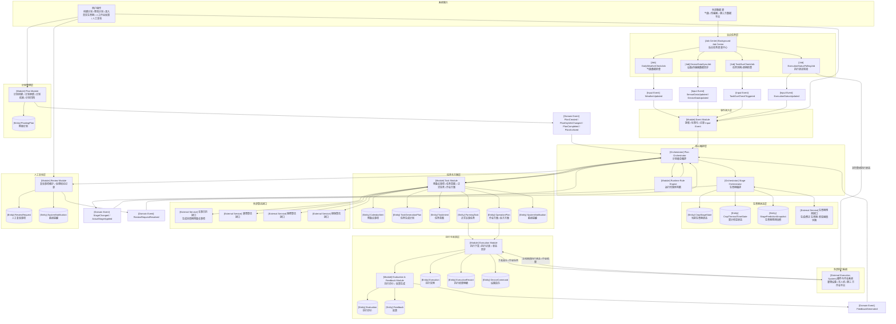

# Plan-level MVP 系统结构图（修正版 v4：移除 Recommendation）

> 本图用于固化当前 Plan-level MVP 架构关系。  
> 本版重点修正：
>
> - 将“硬件与执行系统”从“系统输入”中拆出，单独作为“外部执行系统”
> - 删除 `HW → Background Job Center` 的误导性关系
> - 明确 `Execution Module → HW` 表示执行下发
> - 明确 `HW → Execution Module` 表示硬件/外部平台主动回调
> - 明确 `ExecutionStatusPollingJob → HW` 表示后台轮询兜底
> - MVP 阶段移除独立的 `Recommendation` 对象，农艺建议/推荐依据分别放入 `TaskIntent / FarmingTask / OperationPlan`
> - 删除 `Plan Orchestrator → Task Module` 上过长的复核结论箭头标签，避免结构图连线重叠
> - 明确 `Execution Module` 只消费 `FarmingTask + OperationPlan`

---

# 1. 命名规则

| 标记 | 含义 | 示例 |
|---|---|---|
| `[Job Center]` | 后台任务调度中心 | `[Job Center] Background Job Center` |
| `[Job]` | 具体后台任务 / 定时任务 | `[Job] DailyWeatherCheckJob` |
| `[Input Event]` | 外部输入事件 / 系统检查产生的输入事件 | `[Input Event] WeatherUpdated` |
| `[Domain Event]` | 系统内部业务事件 / 派生事件 | `[Domain Event] StageChanged` |
| `[Module]` | 功能模块 / 业务能力边界 | `[Module] Task Module` |
| `[Orchestrator]` | 编排器 / 流程协调组件 | `[Orchestrator] Plan Orchestrator` |
| `[Entity]` | 业务对象 / 持久化对象 | `[Entity] FarmingTask` |
| `[External Service]` | 外部接口 / 算法服务 | `[External Service] 灌溉算法接口` |
| `[External Execution System]` | 外部执行系统 / 硬件系统 / 作业平台 | `[External Execution System] 灌溉设备` |

---

# 2. 总体结构图



---

# 3. 关键边界说明

## 3.1 系统输入与外部执行系统的区别

系统输入主要包括：

```text
1. 用户操作
2. 外部数据源变化
3. 后台任务检查后产生的 Input Event
```

外部执行系统包括：

```text
1. 灌溉设备
2. 无人机作业平台
3. 第三方作业系统
4. 其他可被调度或查询执行状态的系统
```

外部执行系统不是普通输入源。它和系统之间是双向关系：

```text
Execution Module → 外部执行系统
外部执行系统 → Execution Module
ExecutionStatusPollingJob → 外部执行系统
```

---

## 3.2 硬件 / 外部作业系统的两条链路

### 主链路：执行闭环

```text
Execution Module
  ↓
硬件 / 无人机 / 外部作业系统
  ↓
Execution Module
```

适用于硬件或平台支持主动回调的场景。

---

### 兜底链路：后台轮询

```text
ExecutionStatusPollingJob
  ↓
硬件 / 无人机 / 外部作业系统
  ↓
ExecutionStatusUpdated
  ↓
Event Module
  ↓
Plan Orchestrator
```

适用于：

```text
1. 外部平台不支持 webhook
2. 设备状态需要定时拉取
3. 执行结果延迟生成
4. 需要检查执行是否超时
```

因此不再保留：

```text
HW → Background Job Center
```

这个关系容易误导。

---

## 3.3 农事日历接口归属

```text
Plan Orchestrator 发起初始化流程。
Task Module 调用农事日历接口。
Task Module 保存 CalendarItem / TaskGenerationPlan。
```

不建议：

```text
Plan Orchestrator 直接调用农事日历接口。
```

原因：

```text
CalendarItem / TaskGenerationPlan 属于 Task Module 管理范围。
```

---

## 3.4 MVP 阶段不单独维护 Recommendation

```text
MVP 阶段不将 Recommendation 作为独立 Entity。
```

原因：

```text
1. 具体处方图、施肥量、灌溉量、药剂量、作业参数应归入 OperationPlan。
2. 触发原因、规则判断结果、建议说明应归入 TaskIntent。
3. 正式任务的任务说明、生成原因可归入 FarmingTask。
4. 如果单独维护 Recommendation，容易与 TaskIntent 和 OperationPlan 混淆。
```

后续如果需要独立管理农艺建议流、建议采纳率、建议版本、建议解释，再引入 Recommendation。

---

## 3.5 OperationPlan 归属

```text
OperationPlan 由 Task Module 获取、保存和更新。
```

原因：

```text
OperationPlan 是 FarmingTask 的作业方案，不属于 Plan Orchestrator 的直接管理对象。
```

---

## 3.6 Execution 入口

```text
FarmingTask 是执行入口。
OperationPlan 是执行依据之一。
```

因此：

```text
FarmingTask → Execution Module
OperationPlan → Execution Module
```

有些提醒类或简单人工任务可以没有复杂 `OperationPlan`。

---

## 3.7 TaskIntent 归属

```text
Runtime Rule Engine 负责判断。
Task Module 负责持久化 TaskIntent。
```

链路：

```text
FieldConditionReported
  ↓
Plan Orchestrator
  ↓
Runtime Rule Engine
  ↓
TaskIntent / NeedMoreInfo / NoAction
  ↓
Plan Orchestrator
  ↓
Task Module 保存
```

---

## 3.8 ReviewRequest 归属

```text
Plan Orchestrator 决定是否需要创建 ReviewRequest。
Review Module 负责维护 ReviewRequest 状态和处理结论。
```

链路：

```text
FeedbackGenerated
  ↓
Plan Orchestrator
  ↓
Review Module
  ↓
ReviewRequest + SystemNotification
  ↓
人工复核
  ↓
ReviewRequestResolved
  ↓
Plan Orchestrator
```

---

# 4. 当前设计结论

```text
1. Event Module 只负责事件接入、标准化和记录。
2. Plan Orchestrator 是计划级总编排中心。
3. Stage Orchestrator 负责生育期相关状态。
4. Runtime Rule Engine 负责农事触发类规则判断。
5. Task Module 负责 CalendarItem / TaskIntent / FarmingTask / OperationPlan。
6. MVP 阶段不单独维护 Recommendation。
7. 农艺建议、规则原因、推荐依据分别记录在 TaskIntent / FarmingTask / OperationPlan 中。
8. 农事日历接口由 Task Module 调用。
9. OperationPlan 是作业方案 / 处方方案，由 Task Module 获取和维护。
10. FarmingTask 是执行入口，OperationPlan 是执行依据之一。
11. Execution Module 负责 Execution / ExecutionRecord / DeviceCommand。
12. Execution Module 负责向外部执行系统下发任务或指令。
13. 外部执行系统主动回调时，结果进入 Execution Module。
14. 外部执行系统不主动回调时，由 ExecutionStatusPollingJob 轮询兜底。
15. 不保留 HW → Background Job Center 的直接关系。
16. Evaluation & Feedback Module 负责 Evaluation / Feedback。
17. FeedbackGenerated 回到 Plan Orchestrator。
18. Review Module 负责 ReviewRequest 的状态维护和人工处理记录。
19. ReviewRequestResolved 回到 Plan Orchestrator 后，再协调 Task Module 执行后续动作。
```
