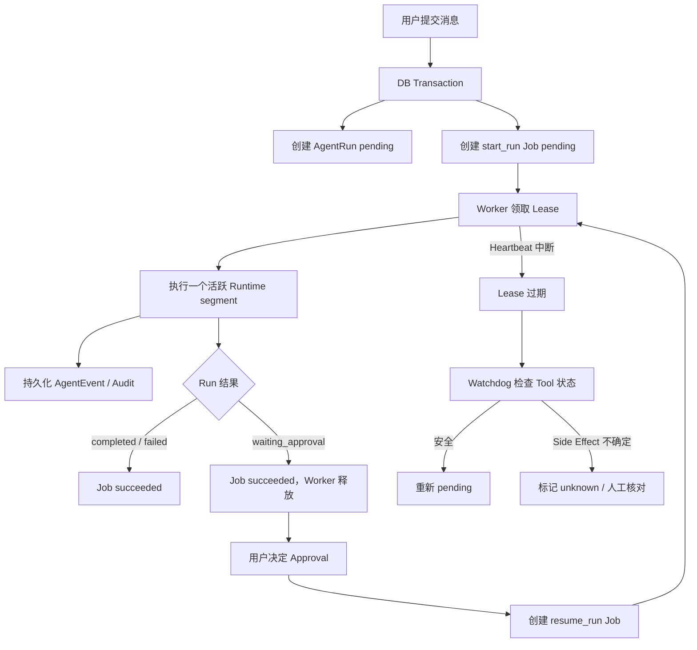

# Agent Runtime Durable Worker、Job 与多实例恢复

状态：Target-state design，尚未实现  
更新时间：2026-07-18

## 1. 为什么当前 Runtime 还需要 Worker

当前链路是：

```text
HTTP 请求进入 FastAPI
-> FastAPI 进程直接运行 Agent Runtime
-> Runtime 调模型、执行 Tool、保存 Event
-> HTTP 请求结束
```

短请求可以工作，但有三个生产问题：

1. 浏览器断开、反向代理超时或 API 实例重启时，执行协程可能消失。
2. API 实例既处理普通接口又执行长模型任务，容易互相占用连接、线程和内存。
3. 多实例下必须知道哪个进程负责某个 Run，并能在负责进程死亡后恢复。

Worker 的目的就是把“接收请求”和“可靠执行”拆开。

## 2. Worker 是什么

Worker 是一个长期运行的后台进程：

```text
while 服务未停止:
    从持久队列领取一个 Job
    执行 Job
    保存结果和事件
    标记 Job 完成
```

Worker 不是：

- 另一个 LLM 或 Subagent；
- CropFlow 的 `FarmingTask`；
- 用户会话；
- 常驻保存 Session 上下文的内存 Agent；
- 每个 Job 新建的一台服务器。

它只是一个执行容器。一个 Worker 进程可以顺序或有限并发地执行多个 Agent Job；一个部署也可以启动多个 Worker 实例。

未来可能提供类似下面的启动命令，但它目前只是目标接口：

```bash
.venv/bin/python -m app.workers.agent_runtime_worker
```

部署时通常是：

```text
API Deployment:     2+ 实例，接收 HTTP / SSE
Agent Worker:       1+ 实例，执行 Agent Job
Recovery Watchdog:  1 个逻辑实例，扫描过期 Lease
PostgreSQL:         保存 Run、Job、Tool、Event、Audit
```

## 3. Job 是什么

Job 是“需要后台可靠执行的一条技术指令”。它必须持久化，不能只放在 Python 内存队列。

CropFlow 中应区分：

| 对象 | 含义 |
|---|---|
| `FarmingTask` | 业务任务，例如施肥、调查、作业执行。 |
| `AgentRun` | 一次 Agent 推理与 Tool 执行过程。 |
| `AgentJob` | 让某个 Worker 启动或恢复 AgentRun 的技术调度记录。 |

一个 AgentRun 可能对应多个 Job：

```text
start_run Job
-> Runtime 运行
-> waiting_approval
-> Worker 结束 Job，不等待用户

用户批准
-> resume_run Job
-> 另一个 Worker 继续同一个 AgentRun
```

建议的 `cf_agent_job` 字段：

| 字段 | 用途 |
|---|---|
| `id` | Job 唯一 id。 |
| `run_id` | 对应 AgentRun。 |
| `kind` | `start_run / resume_run / reconcile_run`。 |
| `status` | `pending / leased / succeeded / failed / dead_letter`。 |
| `payload` | 最小调度参数，不复制业务权威状态。 |
| `available_at` | 何时允许领取，用于延迟重试。 |
| `attempt` / `max_attempts` | Job 级恢复次数。 |
| `lease_owner` | 当前领取它的 Worker id。 |
| `lease_expires_at` | Worker 的临时所有权何时到期。 |
| `heartbeat_at` | Worker 最近一次证明自己仍存活的时间。 |
| `error_code / error_message` | 最终调度错误。 |
| `created_at / updated_at / completed_at` | 审计时间。 |

## 4. Queue 是什么

Queue 是“所有待执行 Job 的有序集合”。第一版用 PostgreSQL 表本身作为 Queue：

```sql
SELECT id
FROM cf_agent_job
WHERE status = 'pending'
  AND available_at <= CURRENT_TIMESTAMP
ORDER BY available_at, created_at
FOR UPDATE SKIP LOCKED
LIMIT 1;
```

`FOR UPDATE SKIP LOCKED` 的意义：

- `FOR UPDATE`：当前事务锁住选中的 Job；
- `SKIP LOCKED`：其他 Worker 不等待这条已锁 Job，而是领取下一条；
- 因此多个 Worker 可以并行领取不同 Job，不会都执行同一条记录。

领取后 Worker 在同一事务中更新：

```text
status = leased
lease_owner = worker-xxx
lease_expires_at = now + 30 seconds
attempt = attempt + 1
```

事务提交后才真正开始执行 Runtime。

## 5. Lease 为什么不是普通锁

数据库行锁只在事务期间存在。如果 Worker 为整个模型调用保持数据库事务和行锁，会造成长事务、连接占用和锁风险。

Lease 是持久化的“限时所有权”：

```text
Worker A 在 10:00:00 领取 Job
lease_expires_at = 10:00:30

Worker A 正常运行：持续续租到 10:01:00、10:01:30...
Worker A 崩溃：不再续租，Lease 最终过期
Watchdog：发现过期并决定是否重排
```

Lease 不是数据库长事务；它是 Job 表上的时间字段。

## 6. Heartbeat 是什么

Heartbeat 是 Worker 定期更新“我还活着”的动作，例如每 10 秒：

```sql
UPDATE cf_agent_job
SET heartbeat_at = CURRENT_TIMESTAMP,
    lease_expires_at = CURRENT_TIMESTAMP + INTERVAL '30 seconds'
WHERE id = :job_id
  AND status = 'leased'
  AND lease_owner = :worker_id;
```

如果更新行数为 0，说明 Worker 已失去 Lease，必须停止继续处理，不能再写完成状态。

Heartbeat 周期必须显著小于 Lease，例如：

```text
heartbeat interval = 10s
lease duration     = 30s
```

## 7. Watchdog 是什么

Watchdog 是周期性检查异常状态的恢复器。它不是模型，也不负责正常业务推理。

它主要查：

```text
status = leased AND lease_expires_at < now
status = running but 长时间没有 Event / Heartbeat
pending Job 长时间无人领取
达到 max_attempts 的失败 Job
```

Watchdog 可以是：

- Worker 进程中的独立定时循环；
- 一个单独进程；
- Kubernetes CronJob；
- CropFlow Background Job Center 的一个任务。

第一版推荐单独命令或 Background Job，但通过 PostgreSQL advisory lock 保证同一时刻只有一个逻辑 Watchdog 扫描。

## 8. Watchdog 不能简单地全部重试

恢复前必须看 Tool 状态：

| 崩溃位置 | 恢复策略 |
|---|---|
| Provider 调用前 | 可重新领取并继续。 |
| Provider 调用中 | 可重新调用；可能产生重复模型费用，但没有业务副作用。 |
| 只读 Query 前或中 | 可按幂等查询重新执行。 |
| 写 Action 尚未通过 Approval | 不执行，继续等待 Approval。 |
| Side Effect 尚未开始 | 可重新 PreAction 后执行。 |
| Side Effect 已明确 completed | 不重放，通过 ToolCall 终态继续。 |
| Side Effect status=running，Worker 消失 | 结果不确定，改为 `unknown`，禁止自动重放。 |

最后一条最重要：分布式系统无法仅凭“没收到响应”证明外部写操作没有成功。因此 CropFlow 应采用 at-least-once Job delivery + 业务幂等 + unknown reconciliation，而不是声称 exactly-once。

## 9. 完整生命周期



## 10. API 应该怎么变

当前：

```text
POST /agent/runs
-> 当前 API 进程直接执行完整 Run
-> 返回最终状态
```

目标：

```text
POST /agent/runs
-> 创建 Run + Job
-> 返回 202 Accepted + run_id

GET /agent/runs/{runId}
-> 返回当前持久化状态

GET /agent/runs/{runId}/events?after=<sequence>
-> 从数据库重放 Event

POST /agent/approvals/{id}/decide
-> 保存决定 + 创建 resume_run Job
-> 返回当前状态，不在 API 请求中执行长任务
```

现有同步执行接口可以在迁移期保留为开发模式，生产配置切换到 queued 模式。

## 11. 多实例 SSE 怎么做

不要把某个 Run 的事件只保存在 Worker 内存或某个 API 实例的本地队列里。`cf_agent_event` 已经是 Source of Truth。

可靠基线：

```text
客户端连接任意 API 实例
-> 携带 after sequence 或 Last-Event-ID
-> API 周期查询 cf_agent_event
-> 推送 sequence 更大的 Event
-> 客户端断线后从最后 sequence 重连
```

这样 API-1 创建 Run、Worker-3 执行、API-2 推送 SSE 也没有问题。

优化方式：PostgreSQL `LISTEN / NOTIFY` 只用来唤醒 API 立即查询；Notify 丢失也没关系，因为权威 Event 仍在表里。Redis Pub/Sub 同样只能作为通知加速层，不能替代持久 Event。

## 12. Worker 如何使用 Runtime

Worker 不重新实现 Agent loop，而是调用现有 Runtime：

```python
job = claim_next_job(worker_id)
runtime = build_runtime_for_job(job)

if job.kind == "start_run":
    await runtime.continue_persisted_run(job.run_id)
elif job.kind == "resume_run":
    await runtime.resume_approved_run(job.run_id, job.payload)

mark_job_succeeded(job.id)
```

为此现有 Runtime 需要从“API command 驱动”进一步拆成：

```text
prepare_run(command)              # API transaction
continue_persisted_run(run_id)    # Worker
record_approval_decision(...)     # API transaction
resume_persisted_run(run_id)      # Worker
```

Worker 每次都从数据库重建 Context，不依赖上一个进程的 Python 对象。

## 13. 并发和幂等边界

至少需要：

1. 同一个 Run 同一时刻只有一个 active Lease。
2. 同一个 Session 是否允许多个 Run，继续由现有 active-run 规则控制。
3. ToolCall id 和 idempotency key 保持唯一。
4. Approval 只能决定一次。
5. Job 完成更新必须校验 `lease_owner`，失去 Lease 的旧 Worker 不能覆盖新 Worker。
6. Side Effect 恢复前必须重新读取业务状态并再次 PreAction。

## 14. Job 重试和 Provider 重试不是一回事

| 重试层 | 处理什么 | 是否重建 Runtime |
|---|---|---|
| Provider retry | 一次 Model HTTP 调用的 429、5xx、timeout。 | 否 |
| Runtime replan | 模型根据 Tool Result 进入下一轮。 | 否 |
| Job retry | Worker 或进程级失败后恢复整个执行段。 | 是，从持久状态恢复 |
| Business retry | 重新发起业务 Action。 | 高风险，必须由幂等、状态和 Approval 控制 |

这四层不能混为一个通用 retry。

## 15. 监控指标

上线前至少监控：

```text
agent_job_pending_count
agent_job_oldest_pending_seconds
agent_job_lease_expired_total
agent_job_attempts
agent_job_dead_letter_total
agent_run_active_seconds
agent_run_waiting_approval_seconds
agent_provider_retry_total by cause_code
agent_run_token_budget_exceeded_total
agent_run_cost_budget_exceeded_total
agent_tool_unknown_total
agent_sse_reconnect_total
```

告警优先级：

```text
P0: unknown Side Effect 持续无人核对
P0: 大量 Job lease expired / dead letter
P1: oldest pending 持续升高
P1: Provider retry / 429 / 5xx 激增
P2: 单模型成本或 Token 使用偏离基线
```

## 16. 分阶段实施

### 6A - Durable Job 基础

- migration 016 和 `AgentJob` Repository；
- `prepare_run` 与 `continue_persisted_run` 拆分；
- 单 Worker `SKIP LOCKED` 领取；
- API 返回 202；
- Approval 创建 `resume_run` Job。

验收：API 进程结束后，已提交 Job 仍可由 Worker 执行。

### 6B - Lease 与恢复

- Worker identity、Lease、Heartbeat；
- Watchdog 与 advisory lock；
- 安全重排、dead letter；
- Side Effect running -> unknown reconciliation。

验收：强制杀死 Worker 后，只读任务可恢复，写操作不重复。

### 6C - 多实例事件交付

- 长连接 SSE polling；
- Last-Event-ID / sequence 恢复；
- 可选 LISTEN / NOTIFY；
- API ×2、Worker ×2 故障注入测试。

验收：客户端切换 API 实例和 Worker 崩溃后，Event 不丢失、不乱序、不重复产生业务副作用。

## 17. 为什么第一版不用 Celery / Redis / Kafka

### PostgreSQL Queue

优点：复用现有基础设施；Run、Job、Approval 可同事务提交；故障排查直观。  
限制：不适合无限高吞吐；需要自己实现 Lease、Heartbeat 和 Watchdog。

### Celery + Redis / RabbitMQ

优点：成熟 Worker、重试和调度生态。  
限制：新增 Broker 运维；数据库状态与消息发布需要 Outbox 解决双写一致性；Celery ack 也不能自动解决业务 Side Effect exactly-once。

### Kafka

优点：高吞吐事件流和长期 replay。  
限制：对当前规模过重；Job claim、延迟调度、Approval resume 仍需额外设计。

因此当前推荐 PostgreSQL Queue，未来达到明确吞吐或跨服务需求后再迁移。迁移时 `AgentJob` 和 `AgentEvent` 仍可作为业务执行与审计事实。

## 18. 当前实现边界

本文描述的 Worker、AgentJob、Lease、Heartbeat、Watchdog 和多实例长连接 SSE 尚未实现。当前已实现的是 Provider retry/error classification、活跃执行段 timeout、Token/可选成本预算，以及数据库 Event replay 基础。
