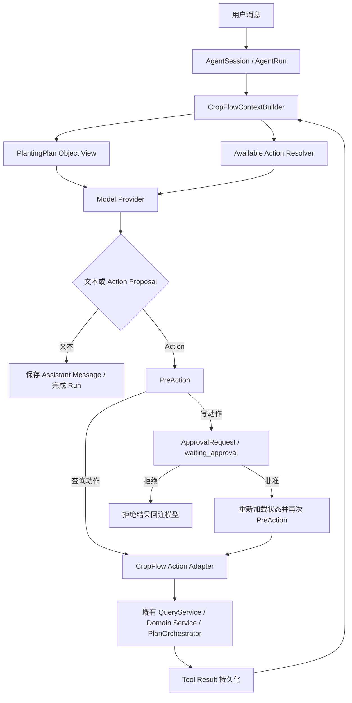

# CropFlow Business Agent Runtime

## 1. 定位

CropFlow Agent Runtime 是业务系统之上的受控执行层。它让模型能够围绕一个真实 `PlantingPlan` 理解业务上下文、查询关联对象并提出业务动作，但不成为第二套业务状态系统。

```text
Model 负责：
  理解用户请求、基于当前上下文推理、选择候选 Action、生成最终说明。

Runtime 负责：
  Session / AgentRun、Context Builder、Available Action Resolver、
  tool result 回注、PreAction、人工批准、幂等、事件、审计和错误状态。

CropFlow 业务系统负责：
  PlantingPlan、FarmingTask、OperationPlan、Execution、ReviewRequest
  等对象的权威状态、业务校验、编排与事务。
```

## 2. 当前执行链路



人工批准不会冻结业务状态。批准后 Runtime 必须重新读取 `FarmingTask / ReviewRequest / PlantingPlan` 最新状态并再次执行 PreAction，避免批准等待期间的状态变化被绕过。

## 3. 当前 Object View

每轮从 CropFlow 权威表重新投影：

```text
PlantingPlan 基础信息和状态
Farm 与 fieldIds
当前 CropStageState
当前 CropThermalTimeState
当前 FarmingTask 摘要（有数量上限）
当前 ReviewRequest 摘要（有数量上限）
当前用户、角色和本轮 available actions
```

`EventRecord` 全历史、完整算法原始结果和大附件不会默认进入 prompt。需要更细证据时由模型调用受限查询 Action。

## 4. 角色和动作

角色从 `cf_user.metadata.agent_roles` 读取。未配置时使用 `CROPFLOW_AGENT_DEFAULT_ROLE`，默认是最小权限的 `observer`。

| 角色 | 当前能力 |
|---|---|
| `observer` | 查看计划上下文、任务详情、复核详情 |
| `operator` | `observer` 查询能力；提出完成 FarmingTask 的动作 |
| `reviewer` | `observer` 查询能力；提出处理 ReviewRequest 的动作 |

当前 Action：

```text
view_plan_context
get_task_detail
get_review_request_detail
complete_farming_task       # 高风险，必须人工批准
resolve_review_request      # 高风险，必须人工批准
```

Runtime 不允许模型传入 active `planting_plan_id` 或当前用户等已知参数。Task / Review id 会在 PreAction 中校验必须属于当前 `PlantingPlan`。

### Tool 并发策略

`ActionContract.parallel_safe=true` 的独立只读 Query 可以在一个 Model Turn 中受控并行。当前三个 Query 都允许并行，最大并发由 `CROPFLOW_AGENT_MAX_PARALLEL_QUERIES` 控制，默认是 `4`。

```text
全部是独立 Query
  -> 独立 SQLAlchemy Session 并行执行
  -> 单独记录 ToolCall / Event / Audit
  -> 按模型原始调用顺序回注全部结果

Query + Write 混合
  -> 先执行 Query
  -> 旧 Write Proposal 标记 side_effect_requires_replan
  -> 模型看到查询结果后重新提出一个 Write Action

多个 Write / Side Effect
  -> 一次只处理一个
  -> 执行或审批后刷新状态再决定下一步
```

Provider 可以返回多个 Tool Calls，但 Runtime 才是并发策略的权威边界。详细取舍见 [ADR 013](../decisions/013-agent-runtime-tool-concurrency-policy.md)。

### Tool 失败回注与结果不确定性

Tool 的失败也是模型下一步决策所需的执行事实。Runtime 将以下终态全部作为 Tool Result 回注：

| 状态 | 含义 | 后续策略 |
|---|---|---|
| `completed` | 确定成功 | 基于结果继续 |
| `rejected` | 被权限、Schema、Scope、状态、审批或调度规则拒绝 | 解释拒绝或重新规划 |
| `failed` | 无副作用 Tool 确定执行失败 | 回注错误，可降级或改用其他安全 Action |
| `unknown` | Side-effect Tool 已开始执行但最终结果不确定 | 禁止自动重试，先查询权威状态或转人工核对 |

串行 Tool 使用独立数据库 savepoint。异常会先回滚本地业务事务，再保存 ToolCall、`tool_execution_failed` Event 和 Audit。由于数据库回滚不能证明外部系统没有接受请求，Side-effect Tool 的异常保守标为 `unknown`，后续写 Action 由 Runtime 拒绝为 `action_outcome_reconciliation_required`。

Context、Provider 或 Runtime 持久化等基础设施已经无法继续时，才将整个 Run 标为 `failed`。详细规则见 [ADR 014](../decisions/014-agent-runtime-tool-failure-reinjection.md)。

## 5. 持久化边界

Runtime 新增表：

```text
cf_agent_session
cf_agent_message
cf_agent_run
cf_agent_tool_call
cf_agent_approval_request
cf_agent_event
cf_agent_audit_record
```

这些表只保存 Agent 执行事实，不复制业务对象状态：

```text
AgentSession         会话边界、active PlantingPlan、用户和选定角色
AgentMessage         用户与助手消息
AgentRun             单次执行、provider state、iteration 和终态
AgentToolCall        模型提议、参数、执行结果和幂等键
AgentApprovalRequest 写动作的明确批准或拒绝
AgentEvent           SSE 与可恢复事件序列
AgentAuditRecord     PreAction、批准、执行和失败审计
```

## 6. Model Provider

当前提供两种 provider：

```text
scripted
  无 API key 的本地开发与确定性测试 provider。
  不能作为真实智能效果或生产模型证据。

openai_compatible
  使用 /chat/completions、function tools 和 tool role result 回注。
  允许模型返回多个 Tool Calls，由 Runtime 判断并行 Query 或串行 Action。
  显式发送 Thinking、Reasoning Effort 和输出 Token 上限。
  将每轮 prompt / cache / completion / reasoning usage 累加到 AgentRun provider_state。
  对 timeout、429 和瞬态 5xx 做有限重试，并记录 HTTP attempt / retry count。
  base URL、API key 和 model 均由环境变量配置，可接兼容接口。
```

当前模型治理配置：

```text
CROPFLOW_AGENT_MODEL_THINKING=enabled
CROPFLOW_AGENT_MODEL_REASONING_EFFORT=high
CROPFLOW_AGENT_MODEL_MAX_OUTPUT_TOKENS=4096
CROPFLOW_AGENT_MODEL_MAX_ATTEMPTS=3
CROPFLOW_AGENT_RUN_EXECUTION_TIMEOUT_SECONDS=180
CROPFLOW_AGENT_RUN_MAX_TOTAL_TOKENS=16000
```

CropFlow 内部使用 `max_output_tokens` 命名，Adapter 映射到当前 DeepSeek Chat Completions 的 `max_tokens`。如果 Provider 返回 `finish_reason=length`，Runtime 将 Run 标记为 `failed / model_output_truncated`，不会把截断回答当成正常完成。

Provider retry 只包围模型 HTTP 调用，不重放 Tool。网络 timeout、408、429、500、502、503、504 最多尝试 3 次，使用 exponential backoff、jitter 和有上限的 `Retry-After`；400、401、402、403、404、422 与协议错误快速失败。最终失败保留 `provider_retry_exhausted.details.cause_code`。

Run 默认有 180 秒活跃执行段和 16,000 cumulative provider tokens。等待人工 Approval 不计入活跃执行时间，恢复后使用新 deadline。成本预算默认关闭；只有显式配置 cache-hit、cache-miss、output 价格和 Run 上限后才启用，避免价格变化造成静默误判。完整决策见 [ADR 016](../decisions/016-agent-runtime-provider-retry-and-run-budget.md)。

用户意图或写 Action 必填参数不明确时，模型先自然语言澄清；用户已经明确要求可用写 Action且参数齐全时，模型直接提出 Tool Call，由 Runtime 创建可持久化、可审计的 ApprovalRequest。自然语言“再确认一次”不能替代 Runtime Approval。

2026-07-18 已使用 DeepSeek V4-Pro 完成真实基础联调：普通 completion、tool call 参数解析、`call_id / reasoning_content` 保留、tool result 回注、只读 Runtime 两轮闭环，以及写 Action 停在 `waiting_approval` 且不产生副作用。该结果验证 provider 和 Runtime 协议，不代表已经使用目标数据库业务数据完成 eval。

同日已建立 development / regression / holdout 三个版本化 Mock Dataset、确定性 Grader 和 Eval Runner。P0 Regression 为 7 个场景、每场景 10 次，另有复杂农艺解释、失败恢复、Tool Result 冲突和多轮澄清 Development 场景；报告记录多 Tool Calls、Token、成本和 p50 / p95 延迟。完整方法、原始报告和结果解释见 [Agent Runtime 模型测试与 Eval 证据](../development/agent-runtime-model-eval.md)。这仍属于真实模型 + Mock Business State 的后端验收，不代表真实数据 Pilot 或生产部署。

模型返回的 arguments 永远按不可信输入处理。即使 provider 支持 strict tool schema，Runtime 仍会执行本地 schema、角色、对象范围、业务状态和批准校验。

Tool call id 会绑定到首次持久化的 run、action 和 arguments；重复的终态 call 不会再次执行。Approval 决策通过数据库行锁串行化，同一请求只能决定一次。

## 7. API 和事件

API contract 见 [Agent Runtime API](../api/agent_runtime_api.md)。

关键事件包括：

```text
run_started
context_built
model_call_started / model_call_completed
tool_call_proposed
tool_execution_started / completed / rejected / failed
approval_required / approval_decided
message_completed
run_completed / run_failed
```

`POST /api/agent/runs/stream` 在当前请求内执行并实时返回 SSE。`GET /api/agent/runs/{runId}/events` 用于重放已持久化事件。

将执行迁移到 Durable Worker、Job、Lease、Heartbeat、Watchdog 和多实例 SSE 的目标设计见 [Agent Runtime Durable Execution](agent-runtime-durable-execution.md) 与 Proposed [ADR 017](../decisions/017-agent-runtime-postgres-durable-worker.md)。这些组件尚未实现。

## 8. 当前生产边界

当前已经是接入 CropFlow 真实业务模型、Repository、Service 和 Orchestrator 的可运行后端切片，但还不等于生产部署完成。

仍需在真实环境完成：

```text
1. 执行 migration 015 并验证真实数据。
2. 为真实用户配置 agent_roles，并接入正式认证、IAM / 数据范围；当前 body 中的 user_id 只是受信调用方上下文，不能作为身份凭证。
3. 基于目标数据库真实业务数据继续做 provider eval 和异常回放；Mock Eval 已覆盖 Token、估算成本和 p50 / p95 延迟，但未证明生产流量和 SLO。
4. 按 Proposed ADR 017 将长任务迁移到 PostgreSQL durable worker，并补 Job Lease、Heartbeat、Watchdog 和 stuck-running recovery。
5. 补多实例 SSE/event delivery、session/run/event sequence 与业务 Action 并发控制，以及更完整的限流/成本治理。
6. 增加 Agent 前端交互和审批界面。
```
