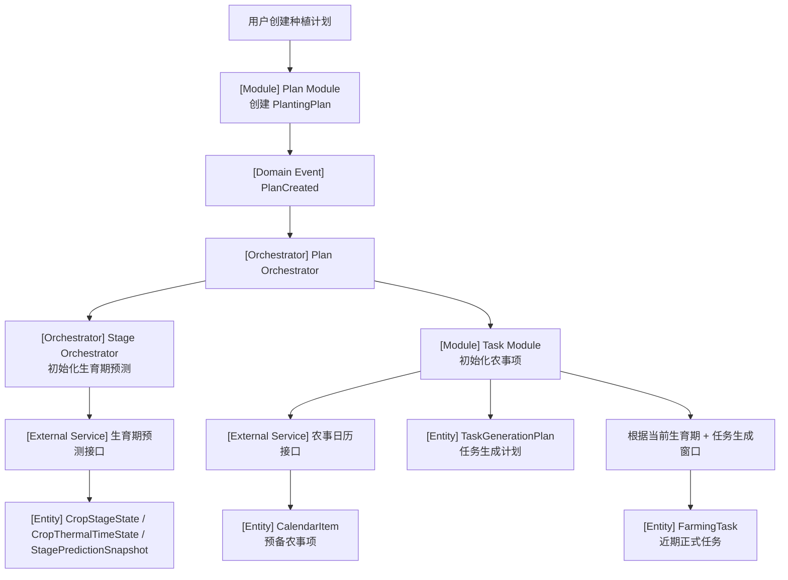

# 计划创建与初始化流程（v2：移除 Recommendation）

---

# 1. 流程目标

创建种植计划后，系统完成：

```text
1. 创建 PlantingPlan
2. 初始化生育期预测
3. 生成全周期预备农事项 CalendarItem
4. 生成 TaskGenerationPlan
5. 根据当前生育期和任务生成窗口生成近期 FarmingTask
```

MVP 阶段不在初始化阶段单独生成 `Recommendation`。

---

# 2. 主流程

```text
用户创建计划
  ↓
Plan Module 创建 PlantingPlan
  ↓
产生 PlanCreated
  ↓
Plan Orchestrator 接收
  ↓
Stage Orchestrator 初始化生育期
  ↓
Task Module 调用农事日历接口
  ↓
生成 CalendarItem / TaskGenerationPlan
  ↓
Task Module 根据当前阶段和时间窗口生成 FarmingTask
```

---

# 3. Mermaid 流程



---

# 4. 关键规则

## 4.1 先生成预备农事项，再生成正式任务

```text
CalendarItem 是全周期预备农事项。
FarmingTask 是近期正式任务。
```

不建议创建计划时一次性生成整个种植季的所有正式任务。

---

## 4.2 正式任务生成窗口

默认可以先按：

```text
14 天
```

后续可配置。

---

## 4.3 计划关键字段变更

当品种、播期、地块、种植区域等关键字段变化时：

```text
PlanKeyInfoChanged
  ↓
Plan Orchestrator
  ↓
Stage Orchestrator 重新预测生育期
  ↓
Task Module 更新 CalendarItem / FarmingTask / OperationPlan
```

原则：

```text
1. 未执行任务可以更新
2. 已执行任务保留历史
3. 失效 CalendarItem 标记 invalidated，默认前端不显示
```

---

# 5. OperationPlan 的生成时机

不是所有任务在初始化时都需要立刻生成 `OperationPlan`。

建议按任务类型配置：

```text
1. 需要提前生成方案的任务：生成 FarmingTask 后生成 OperationPlan
2. 需要执行前实时计算的任务：执行前生成 OperationPlan
3. 提醒类任务：可以没有 OperationPlan
```

---

# 6. MVP 阶段移除 Recommendation

原来讨论中的：

```text
Recommendation
```

在本流程中不再作为独立对象生成。

替代方式：

```text
1. 任务生成原因放入 FarmingTask
2. 方案依据放入 OperationPlan
3. 用户提醒放入 SystemNotification
```

---

# 7. 本流程输出

```text
PlantingPlan
CropStageState
CropThermalTimeState
StagePredictionSnapshot
CalendarItem
TaskGenerationPlan
FarmingTask
必要时生成 OperationPlan
必要时生成 SystemNotification
```
