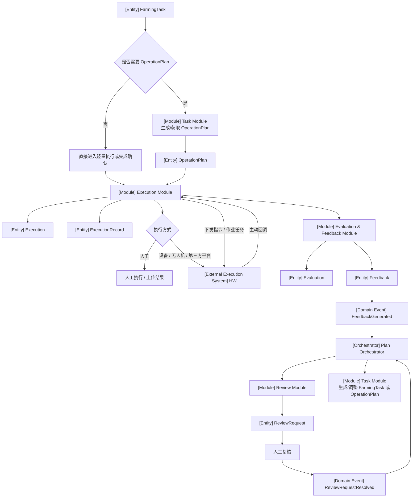

# 任务执行与反馈闭环流程（v2：移除 Recommendation）

---

# 1. 流程目标

当正式任务生成后，系统支持任务执行、结果记录、执行评价、反馈生成和人工复核。

---

# 2. 主流程

```text
FarmingTask
  ↓
OperationPlan
  ↓
Execution
  ↓
ExecutionRecord
  ↓
Evaluation
  ↓
Feedback
  ↓
ReviewRequest
  ↓
人工复核
  ↓
调整后续 FarmingTask / OperationPlan
```

---

# 3. Mermaid 流程



---

# 4. Execution Module 边界

## 输入

```text
FarmingTask
OperationPlan
```

## 输出

```text
Execution
ExecutionRecord
DeviceCommand
```

## 不输入

```text
Recommendation
```

MVP 阶段没有独立 `Recommendation` 对象。

---

# 5. 外部执行系统状态获取

## 5.1 主动回调

```text
Execution Module
  ↓
HW
  ↓
Execution Module
```

## 5.2 后台轮询兜底

```text
ExecutionStatusPollingJob
  ↓
HW
  ↓
ExecutionStatusUpdated
  ↓
Event Module / Execution Module
```

---

# 6. Evaluation 与 Feedback

## Evaluation

评价执行是否符合方案。

示例：

```text
1. 是否按 OperationPlan 完成
2. 实际作业量是否达标
3. 实际区域是否匹配
4. 执行时间是否合适
5. 是否存在异常
```

## Feedback

反馈是评价后的业务结果。

示例：

```text
1. 作业合格
2. 作业不完整
3. 需要补救任务
4. 需要调整后续任务
5. 需要人工复核
```

---

# 7. Feedback 不直接生成任务

原则：

```text
FeedbackGenerated
  ↓
Plan Orchestrator
  ↓
Review Module / Task Module
```

原因：

```text
1. 是否新增任务需要结合计划上下文
2. 是否更新后续任务需要统一编排
3. MVP 阶段建议关键反馈进入人工复核
```

---

# 8. ReviewRequest 复核后可能动作

```text
1. 生成补救 FarmingTask
2. 更新已有 FarmingTask
3. 更新 OperationPlan
4. 标记无需处理
5. 要求补充执行信息
```

---

# 9. MVP 阶段移除 Recommendation

执行流程中不再出现独立 `Recommendation`。

原本可能放在 Recommendation 中的内容，现在处理如下：

| 内容 | 放置位置 |
|---|---|
| 作业方案依据 | OperationPlan |
| 执行前说明 | FarmingTask |
| 异常原因 | Evaluation / Feedback |
| 人工处理建议 | ReviewRequest |

---

# 10. 本流程输出

```text
Execution
ExecutionRecord
DeviceCommand
Evaluation
Feedback
ReviewRequest
SystemNotification
```
