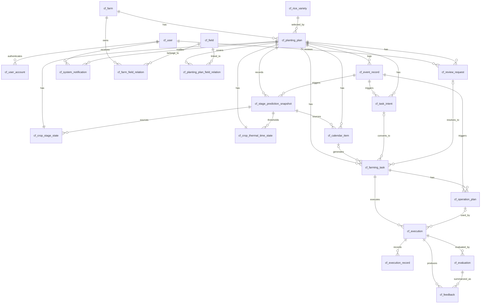

# CropFlow Plan-level MVP Data Model

> 本文档定义 CropFlow MVP 的逻辑数据模型草案。  
> 当前已确认后端采用 Python + FastAPI，数据库采用 PostgreSQL，部署方式采用 Docker；本文仍以逻辑模型为主，不展开具体 DDL 和工程细节。

---

# 1. 建模原则

```text
1. 以单个 PlantingPlan 为主要业务边界。
2. 不引入独立 Recommendation Entity。
3. CalendarItem 是预备农事项，不是正式任务。
4. FarmingTask 是正式任务，是 Execution Module 的入口。
5. OperationPlan 是具体作业方案 / 处方方案。
6. Execution Module 只消费 FarmingTask + OperationPlan。
7. Feedback 不直接生成 FarmingTask，必须回到 Plan Orchestrator。
8. ReviewRequestResolved 不直接绕过编排器，必须回到 Plan Orchestrator。
9. NeedMoreInfo / NoAction 是 TaskIntent 状态或规则判断结果，不是独立核心对象。
10. EventRecord 是事件接入和追溯记录，不是业务决策对象。
11. Farm / Field 在 MVP 第一版进入数据模型，但不做跨农场、多计划全局调度。
12. 农事类型采用 taskCategory + taskSubtype 两级表达，允许后续新增 subtype。
```

---

# 2. 逻辑类型约定

本文使用以下逻辑类型：

```text
id：唯一标识，后续可落为 UUID、雪花 ID 或数据库自增 ID。
string：短文本。
text：长文本。
date：日期。
datetime：日期时间。
decimal：精确数值。
integer：整数。
boolean：布尔值。
enum：枚举值。
json：结构化扩展数据。
```

---

# 3. 通用字段

## 3.1 审计字段

多数持久化对象建议包含：

| 字段 | 类型 | 说明 |
|---|---|---|
| id | id | 主键 |
| createdAt | datetime | 创建时间 |
| updatedAt | datetime | 最近更新时间 |
| createdByType | enum | user / system / external |
| createdById | string | 创建者标识，可为空 |
| version | integer | 乐观锁或业务版本 |

## 3.2 追溯字段

由事件、规则、复核或外部系统生成的对象建议包含：

| 字段 | 类型 | 说明 |
|---|---|---|
| sourceType | enum | 来源类型，例如 calendar / rule / review / feedback / manual / external |
| sourceEventId | id | 来源 EventRecord |
| sourceEntityType | string | 来源对象类型 |
| sourceEntityId | id | 来源对象 ID |
| reason | text | 生成或变更原因 |
| idempotencyKey | string | 业务幂等键 |

---

# 4. 实体清单

## 4.1 计划与生育期

```text
Farm
Field
PlantingPlan
CropStageState
CropThermalTimeState
StagePredictionSnapshot
```

## 4.2 农事项与任务

```text
CalendarItem
TaskIntent
FarmingTask
OperationPlan
```

## 4.3 执行与反馈

```text
Execution
ExecutionRecord
DeviceCommand
Evaluation
Feedback
```

## 4.4 复核与通知

```text
ReviewRequest
SystemNotification
```

## 4.5 事件记录

```text
EventRecord
```

`EventRecord` 用于 Event Module 接收、标准化和记录事件，支撑幂等、追溯和重放分析。

## 4.6 物料与库存

```text
InventoryItem
InventoryTransaction
```

药剂和肥料入库需要独立库存表。MVP 只记录最小库存主数据和出入库流水，不做完整仓储、库位、盘点或财务成本系统。

---

# 5. 实体关系

```text
User 1 - N UserAccount
User 1 - N ReviewRequest
User 1 - N SystemNotification
Farm 1 - N FarmFieldRelation
Field 1 - N FarmFieldRelation
RiceVariety 1 - N PlantingPlan
Farm 1 - N InventoryItem
InventoryItem 1 - N InventoryTransaction

PlantingPlan 1 - N PlantingPlanFieldRelation
Field 1 - N PlantingPlanFieldRelation

PlantingPlan 1 - 1 CropStageState
PlantingPlan 1 - 1 CropThermalTimeState
PlantingPlan 1 - N StagePredictionSnapshot

PlantingPlan 1 - N CalendarItem
CalendarItem 0..1 - 0..1 FarmingTask

PlantingPlan 1 - N TaskIntent
TaskIntent 0..1 - 0..1 FarmingTask

PlantingPlan 1 - N FarmingTask
FarmingTask 1 - N OperationPlan
FarmingTask 1 - N Execution

OperationPlan 0..1 - N Execution
Execution 1 - N ExecutionRecord
Execution 1 - 0..N DeviceCommand
Execution 1 - 0..N Evaluation
Evaluation 1 - N Feedback

Feedback 0..1 - 0..1 ReviewRequest
TaskIntent 0..1 - 0..1 ReviewRequest
ReviewRequest 0..1 - 0..1 FarmingTask

PlantingPlan 1 - N SystemNotification
PlantingPlan 1 - N EventRecord
PlantingPlan 0..1 - N InventoryTransaction
```

## 5.1 ER 图



说明：

```text
1. 本图对应 database/sql/20260518_weed_protection_closed_loop.sql 的当前主表关系。
2. ReviewRequest.sourceEntityType/sourceEntityId 是多态来源，不在图中画成固定外键。
3. InventoryItem / InventoryTransaction 不在当前杂草防治闭环 DDL 范围内，因此未在图中展开。
4. 当前主链路为 PlantingPlan -> CalendarItem -> FarmingTask -> Execution -> ExecutionRecord -> Evaluation / Feedback -> ReviewRequest。
5. ReviewRequest.assignedUserId / resolvedBy、SystemNotification.targetUserId 指向 User 表。
6. UserAccount 负责登录认证，不直接参与业务复核或通知关系。
```

说明：

```text
1. OperationPlan 可以有 0 个、1 个或多个；提醒类任务可以没有复杂 OperationPlan。
2. ReviewRequest 的处理结果不能直接绕过 Plan Orchestrator。
3. EventRecord 可以关联多个后续业务对象，但业务对象不应依赖 EventRecord 执行业务判断。
4. DeviceCommand 只在设备、无人机或第三方系统执行场景出现；是否限制一对一留到后续确认。
5. 当前 MVP 语义下，一个 CalendarItem / TaskIntent / ReviewRequest 最多只直接对应一个 FarmingTask。
6. 如后续需要补救任务、复查任务或新的服务任务，应由 Plan Orchestrator 新建新的 CalendarItem、TaskIntent 或 ReviewRequest，再进入后续链路，而不是让同一个上游对象直接派生多个 FarmingTask。
```

---

# 6. 字段草案

## 6.0 User

| 字段 | 类型 | 说明 |
|---|---|---|
| id | string | 用户 ID |
| userCode | string | 用户编码，可为空 |
| username | string | 登录名或唯一用户名 |
| displayName | string | 展示名，可为空 |
| mobile | string | 手机号，可为空 |
| email | string | 邮箱，可为空 |
| status | enum | active / inactive |
| metadata | json | 扩展信息 |
| createdAt | datetime | 创建时间 |
| updatedAt | datetime | 更新时间 |

说明：

```text
User 负责业务身份，主要用于 ReviewRequest 指派 / 处理，以及 SystemNotification 接收人。
登录认证信息放在独立 UserAccount，不与业务用户表混存。
完整权限、组织、角色体系不进入当前 MVP 数据模型。
```

## 6.0.1 UserAccount

| 字段 | 类型 | 说明 |
|---|---|---|
| id | id | 账户 ID |
| userId | string | 所属 User |
| accountType | enum | password / sms / oauth / wecom 等，第一版默认 password |
| loginName | string | 登录名，唯一 |
| passwordHash | string | 密码哈希，可为空 |
| status | enum | active / disabled / locked |
| lastLoginAt | datetime | 最近登录时间，可为空 |
| lastLoginIp | string | 最近登录 IP，可为空 |
| passwordChangedAt | datetime | 最近密码修改时间，可为空 |
| failedLoginCount | integer | 连续失败次数 |
| lockedUntil | datetime | 锁定截止时间，可为空 |
| metadata | json | 认证扩展信息 |
| createdAt | datetime | 创建时间 |
| updatedAt | datetime | 更新时间 |

说明：

```text
UserAccount 负责登录认证，第一版只要求支持 password 账号密码登录。
passwordHash 只存密码哈希，不存明文密码。
推荐使用 Argon2id 或 bcrypt，不在表中单独设计明文 password 字段。
一个 User 当前可对应多个 UserAccount，但同一 userId + accountType 组合唯一。
```

## 6.1 Farm

| 字段 | 类型 | 说明 |
|---|---|---|
| id | id | 农场 ID |
| farmName | string | 农场名称 |
| externalFarmId | string | 外部平台农场 ID，可为空；用于对接天气等外部接口 |
| province | string | 所属省份，可为空但生育期算法联调时应补齐 |
| city | string | 所属地级市，可为空但生育期算法联调时应补齐 |
| districtCounty | string | 所属区 / 县 / 县级市，可为空但生育期算法联调时应补齐 |
| adcode | string | 行政区编码，可为空但生育期算法联调时应补齐 |
| boundaryWkt | text | 农场边界 WKT，可为空 |
| centroidLat | decimal | 中心点纬度，可为空 |
| centroidLon | decimal | 中心点经度，可为空 |
| createdAt | datetime | 创建时间 |
| updatedAt | datetime | 更新时间 |

## 6.2 Field

| 字段 | 类型 | 说明 |
|---|---|---|
| id | id | 地块 ID |
| fieldName | string | 地块名称 |
| boundaryWkt | text | 地块边界 WKT，可为空 |
| centroidLat | decimal | 中心点纬度，可为空 |
| centroidLon | decimal | 中心点经度，可为空 |
| areaHa | decimal | 地块面积，单位公顷，可为空 |
| createdAt | datetime | 创建时间 |
| updatedAt | datetime | 更新时间 |

说明：

```text
Farm.centroidLat / Farm.centroidLon 表示农场中心点。
Farm.province / city / districtCounty / adcode 用于结构化保存区域信息，供生育期等算法输入使用。
Farm.externalFarmId 用于保存外部平台农场标识，供气象等按农场取数的接口使用。
Field 不再直接保存 farmId，农场与地块关系通过 FarmFieldRelation 维护。
Field 第一版对齐 agri_field，保留地块名称、边界 WKT、中心点和面积。
土壤类型、土壤肥力、前茬作物等信息当前不在 agri_field 中，第一版先不结构化。
```

## 6.3 PlantingPlan

| 字段 | 类型 | 说明 |
|---|---|---|
| id | id | 种植计划 ID |
| planCode | string | 计划编号 |
| planName | string | 计划名称 |
| farmId | id | 所属 Farm |
| year | integer | 年份，可为空 |
| cultiTypeCode | integer | 栽培类型字典 code，引用 cf_code_dict.code，例如 5=早稻 |
| plantingMethodCode | integer | 种植方式字典 code，引用 cf_code_dict.code，例如 1=直播 |
| cropName | string | 作物，映射 agri_crop_season.crop_type |
| varietyId | id | 所属 RiceVariety |
| varietyName | string | 品种名称快照 |
| sowingDate | date | 播种日期 |
| transplantDate | date | 移栽日期，可为空 |
| harvestDate | date | 收获日期，可为空 |
| transplantLeafAge | decimal | 移栽时叶龄，可为空 |
| previousHarvestDate | date | 上一茬收割日期，可为空 |
| ratoonFirstSeasonHarvestDate | date | 再生稻头季收割日期，可为空 |
| expectedHarvestDate | date | 预计采收日期 |
| status | enum | 计划状态 |
| taskGenerationWindowDays | integer | 默认任务生成窗口 |
| createdAt | datetime | 创建时间 |
| updatedAt | datetime | 更新时间 |
| metadata | json | 计划扩展信息 |

说明：

```text
PlantingPlan 保留 farmId，对齐 agri_crop_season 的 season 归属农场语义。
PlantingPlan 不再直接保存 fieldId，计划与地块关系通过 PlantingPlanFieldRelation 维护。
varietyId 关联独立 RiceVariety；varietyName 作为展示和历史追溯快照保留。
expectedHarvestDate 第一版由系统预测生成，不作为用户必填字段。
sowingDate 是必填计划字段；transplantDate 仅在 plantingMethodCode = 3（插秧）时需要。
PlantingPlan 中只保留计划创建、页面展示、任务生成和算法高频共用字段。
cultiTypeCode 已覆盖当前 cropSeason / riceCroppingType 语义，第一版不再重复保留这两个字段。
业务基础枚举不直接存中文展示值，而是直接引用 cf_code_dict.code。
审定稻作类型、品种熟制、审定亚种、审定区域、对照品种、生育期差距、返青天数等字段当前不是 3、4 节算法明确必需字段，第一版先放 PlantingPlan.metadata 或 StagePredictionSnapshot.inputPayload；开发时确认高频查询或稳定复用后再结构化。
算法专用或临时输入仍可进入 StagePredictionSnapshot.inputPayload / EventRecord.payload。
字段命名和口径优先对齐外部参考表 agri_crop_season；当前文档先收口语义，不替代原始 DDL。
```

## 6.3.1 RiceVariety

| 字段 | 类型 | 说明 |
|---|---|---|
| id | id | 品种 ID |
| name | string | 品种名称 |
| approveYear | integer | 审定年份，可为空 |
| approveNo | string | 审定编号，可为空 |
| approveRegion | string | 审定区域，可为空 |
| suitableRegion | string | 适宜区域，可为空 |
| cultiTypeCode | integer | 栽培类型字典 code，可为空，引用 cf_code_dict.code |
| subTypeCode | integer | 亚种字典 code，例如 9=籼 |
| maturityCode | integer | 熟期字典 code，可为空，引用 cf_code_dict.code |
| controlVariety | string | 对照品种，可为空 |
| growthDays | decimal | 生育天数，可为空 |
| compareDays | decimal | 比对天数，可为空 |
| riceCode | string | 品种编码，可为空 |

说明：

```text
RiceVariety 第一版按用户提供的 agri_rice_variety 结构建模。
PlantingPlan 通过 varietyId 关联 RiceVariety，同时保留 varietyName 快照用于历史展示。
RiceVariety.cultiTypeCode / subTypeCode / maturityCode 均引用 cf_code_dict.code。
subType 当前业务枚举为籼 / 粳 / 籼粳交，在业务表中存原始 code，例如 9 / 10 / 11。
```

## 6.3.1.1 cf_code_dict 约定

| 列别名 | 原始列 | 说明 |
|---|---|---|
| id | agri_code_dict.id | 主键，自增 |
| code | agri_code_dict.code | 业务表引用的字典值 |
| displayName | agri_code_dict.code_name | 展示名称，例如 早稻 / 直播 / 籼 |
| dictType | agri_code_dict.category | 字典类型，例如 culti_type / sowingmtd / sub_type / maturity |
| isActive | agri_code_dict.is_active | 是否启用 |

说明：

```text
cf_code_dict 的表结构和初始化数据沿用 agri_code_dict。
业务表统一保存 cf_code_dict.code，前端展示再通过 displayName 转义。
cf_code_dict.dictType 当前至少使用 culti_type、sowingmtd、sub_type、maturity。
```

## 6.3.2 FarmFieldRelation

| 字段 | 类型 | 说明 |
|---|---|---|
| id | id | 关系 ID |
| farmId | id | 所属 Farm |
| fieldId | id | 所属 Field |
| createdAt | datetime | 创建时间 |
| updatedAt | datetime | 更新时间 |

说明：

```text
FarmFieldRelation 用于维护农场与地块的归属关系。
当前参考 ddl.sql 中 agri_field 直接保存 farm_id，但当前业务口径要求显式拆出 FarmFieldRelation，因此关系表保留 farmId / fieldId / createdAt / updatedAt 四类字段。
```

## 6.3.3 PlantingPlanFieldRelation

| 字段 | 类型 | 说明 |
|---|---|---|
| id | id | 关系 ID |
| plantingPlanId | id | 所属 PlantingPlan |
| fieldId | id | 所属 Field |
| createdAt | datetime | 创建时间 |
| updatedAt | datetime | 更新时间 |

说明：

```text
PlantingPlanFieldRelation 用于维护种植计划与地块关系，是 PlantingPlan 获取地块上下文的唯一入口。
第一版显式取消 PlantingPlan.fieldId。
字段命名和口径优先对齐 agri_field_crop_season：核心关系为 fieldId + plantingPlanId 对应 field_id + season_id，并保留 createdAt / updatedAt。
```

## 6.4 CropStageState

| 字段 | 类型 | 说明 |
|---|---|---|
| id | id | 生育期状态 ID |
| plantingPlanId | id | 所属 PlantingPlan |
| currentStageCode | string | 当前生育期编码 |
| currentStageName | string | 当前生育期名称 |
| stageSource | enum | predicted / manual / system_adjusted |
| effectiveDate | date | 当前阶段生效日期 |
| sourceSnapshotId | id | 来源 StagePredictionSnapshot |
| lastUpdatedAt | datetime | 最近更新时间 |
| version | integer | 版本 |

## 6.5 CropThermalTimeState

| 字段 | 类型 | 说明 |
|---|---|---|
| id | id | 积温状态 ID |
| plantingPlanId | id | 所属 PlantingPlan |
| accumulatedThermalTime | decimal | 当前累计积温 |
| thermalTimeUnit | string | 积温单位 |
| baseTemperature | decimal | 基准温度 |
| startDate | date | 起算日期，第一版固定按 sowingDate 起算 |
| lastCalculatedDate | date | 最近计算日期 |
| thresholdSnapshotId | id | 使用的阈值快照 |
| dataVersion | string | 气象或计算数据版本 |

## 6.6 StagePredictionSnapshot

| 字段 | 类型 | 说明 |
|---|---|---|
| id | id | 快照 ID |
| plantingPlanId | id | 所属 PlantingPlan |
| predictionVersion | integer | 预测版本 |
| predictionSource | enum | initial / weather_update / manual_adjustment / plan_change |
| algorithmCode | string | 预测算法编码 |
| algorithmVersion | string | 预测算法版本，可为空 |
| generatedAt | datetime | 生成时间 |
| inputPayload | json | 预测输入快照 |
| stageTimeline | json | 生育期时间线 |
| thermalThresholds | json | 生育期积温阈值或算法使用的阈值快照 |
| sourceEventId | id | 来源事件 |

说明：

```text
生育期预测算法当前只返回预测时间线，不直接返回当前阶段。
CropStageState.currentStageCode 由 Stage Orchestrator 根据 stageTimeline 和当前日期计算或由人工录入修正。
人工录入真实生育期时，优先修正 CropStageState；CropThermalTimeState 仍按 sowingDate 持续累计，不因人工反馈重新起算。
stageTimeline 第一版保存算法返回的各生育期节点日期。
算法版本如果外部服务暂不返回，可以为空；algorithmCode 仍用于标识调用的算法接口。
```

## 6.7 CalendarItem

| 字段 | 类型 | 说明 |
|---|---|---|
| id | id | 预备农事项 ID |
| plantingPlanId | id | 所属 PlantingPlan |
| stageCode | string | 关联生育期编码，可为空，仅适用于阶段相关农事项 |
| taskCategory | enum | 农事大类 |
| taskSubtype | string | 农事子类 |
| title | string | 农事项标题 |
| description | text | 农事项说明 |
| suggestedStartDate | date | 建议开始日期 |
| suggestedEndDate | date | 建议结束日期 |
| status | enum | 预备农事项状态 |
| calendarVersion | integer | 日历版本 |
| sourceSnapshotId | id | 来源预测或日历快照 |
| parentTaskId | id | 上游前置 FarmingTask，可为空 |
| sourceExecutionId | id | 触发该农事项的 Execution，可为空 |
| sourceExecutionRecordId | id | 触发该农事项的 ExecutionRecord，可为空 |
| generationCondition | json | 正式任务生成条件，可为空 |
| generatedTaskId | id | 已生成 FarmingTask，可为空 |
| lastGenerationCheckedAt | datetime | 最近一次生成检查时间，可为空 |
| invalidatedReason | text | 失效原因 |
| idempotencyKey | string | 幂等键 |

说明：

```text
MVP 第一版不把 TaskGenerationPlan 作为核心对象或独立表。
CalendarItem 承载预备农事项、建议时间和轻量生成条件。
TaskDueCheckJob / TaskGenerationService 根据 CalendarItem 生成 FarmingTask。
并非所有 CalendarItem 都必须绑定生育期；stageCode 只在阶段驱动或算法明确返回阶段上下文时填写。
如果 CalendarItem 来自运行期任务后的补充调查、复查或评估日期推荐，应记录 parentTaskId 和 sourceExecutionRecordId，保证来源可追溯。
如果后续出现复杂生成窗口、重试、跳过原因、多次生成计划历史，再考虑重新引入 TaskGenerationPlan。
```

## 6.8 TaskIntent

| 字段 | 类型 | 说明 |
|---|---|---|
| id | id | 任务意图 ID |
| plantingPlanId | id | 所属 PlantingPlan |
| taskCategory | enum | 建议农事大类 |
| taskSubtype | string | 建议农事子类 |
| priority | enum | low / normal / high / urgent |
| status | enum | 任务意图状态 |
| triggerType | enum | field_condition / sensor / device / feedback / review / manual / survey_result |
| triggerSummary | text | 触发摘要 |
| ruleResult | json | 规则判断结果 |
| suggestedAction | text | 建议处理方向 |
| needMoreInfoFields | json | 需要补充的信息 |
| noActionReason | text | 无需动作原因 |
| parentTaskId | id | 上游前置 FarmingTask，可为空 |
| sourceExecutionId | id | 触发该建议的 Execution，可为空 |
| sourceExecutionRecordId | id | 触发该建议的 ExecutionRecord，可为空 |
| convertedTaskId | id | 转换后的 FarmingTask，可为空 |
| sourceEventId | id | 来源事件 |
| idempotencyKey | string | 幂等键 |

## 6.9 FarmingTask

| 字段 | 类型 | 说明 |
|---|---|---|
| id | id | 正式任务 ID |
| plantingPlanId | id | 所属 PlantingPlan |
| calendarItemId | id | 来源 CalendarItem，可为空 |
| taskIntentId | id | 来源 TaskIntent，可为空 |
| reviewRequestId | id | 来源 ReviewRequest，可为空 |
| taskCategory | enum | 农事大类 |
| taskSubtype | string | 农事子类 |
| title | string | 任务标题 |
| description | text | 任务说明 |
| targetStageCode | string | 目标生育期，可为空，仅适用于阶段相关正式任务 |
| plannedStartAt | datetime | 计划开始时间 |
| plannedEndAt | datetime | 计划结束时间 |
| priority | enum | low / normal / high / urgent |
| status | enum | 正式任务状态 |
| executionMode | enum | manual / device / drone / third_party |
| generationReason | text | 任务生成原因 |
| parentTaskId | id | 上游前置 FarmingTask，可为空 |
| sourceExecutionId | id | 触发该任务生成的 Execution，可为空 |
| sourceExecutionRecordId | id | 触发该任务生成的 ExecutionRecord，可为空 |
| idempotencyKey | string | 幂等键 |

说明：

```text
FarmingTask.targetStageCode 不要求所有任务都有值。
如果任务来自阶段驱动 CalendarItem，或算法/复核明确给出阶段目标，则填写；否则保持为空。
如果任务来自运行期调查、补防建议或复核决策，建议同时记录 parentTaskId 和 sourceExecutionRecordId，以区分“来自哪个前置任务”和“由哪次结果录入具体触发”。
```

## 6.10 OperationPlan

| 字段 | 类型 | 说明 |
|---|---|---|
| id | id | 作业方案 ID |
| plantingPlanId | id | 所属 PlantingPlan |
| farmingTaskId | id | 所属 FarmingTask |
| planType | enum | 作业方案类型，通常与 taskCategory 对齐 |
| status | enum | 作业方案状态 |
| version | integer | 方案版本 |
| algorithmCode | string | 算法接口编码 |
| algorithmVersion | string | 算法版本，可为空 |
| operationArea | json | 作业区域 |
| operationWindowStart | datetime | 作业窗口开始 |
| operationWindowEnd | datetime | 作业窗口结束 |
| executionMode | enum | manual / device / drone / third_party |
| parameters | json | 作业参数，例如灌溉量、施肥量、药剂量 |
| prescriptionMap | json | 处方图或区域处方 |
| acceptanceCriteria | json | 验收标准 |
| basis | text | 方案依据 |
| sourceEventId | id | 来源事件 |
| idempotencyKey | string | 幂等键 |

说明：

```text
同一 FarmingTask 同一时间只允许一个 active OperationPlan。
历史方案通过 superseded / invalidated 状态保留。
植保 OperationPlan.parameters 第一版可承载植保诊断接口直接返回的兑水量、处方数组、农药、剂型、厂商、推荐用量，以及 strategy / target / stage、杂草萌发起始日期、防治对象等算法输入摘要。
植保防治日期来自诊断接口时，优先映射到 operationWindowStart / operationWindowEnd；多个推荐日期可同时保存在 parameters.recommendedControlDates。
安全间隔期和天气窗口当前植保接口未显式返回，第一版不新增独立字段。
```

## 6.11 Execution

| 字段 | 类型 | 说明 |
|---|---|---|
| id | id | 执行实例 ID |
| plantingPlanId | id | 所属 PlantingPlan |
| farmingTaskId | id | 关联 FarmingTask |
| operationPlanId | id | 关联 OperationPlan，可为空 |
| executionMode | enum | manual / device / drone / third_party |
| status | enum | 执行状态 |
| assignedToType | enum | user / device / external_system |
| assignedToId | string | 执行主体标识 |
| externalSystemCode | string | 外部系统编码 |
| externalExecutionId | string | 外部执行编号 |
| startedAt | datetime | 开始时间 |
| completedAt | datetime | 完成时间 |
| failureReason | text | 失败原因 |

说明：

```text
同一 FarmingTask 允许多次 Execution，用于失败重试、分批执行或补执行。
```

## 6.12 ExecutionRecord

| 字段 | 类型 | 说明 |
|---|---|---|
| id | id | 执行记录 ID |
| plantingPlanId | id | 所属 PlantingPlan |
| executionId | id | 所属 Execution |
| recordType | enum | status_update / result / manual_upload / device_callback / survey_result |
| recordTime | datetime | 记录时间 |
| actualStartAt | datetime | 实际开始时间 |
| actualEndAt | datetime | 实际结束时间 |
| actualArea | decimal | 实际作业面积 |
| actualAmount | decimal | 实际用量 |
| amountUnit | string | 用量单位 |
| resultPayload | json | 外部回调或人工上传明细 |
| attachments | json | 图片、轨迹、文件等 |

## 6.13 DeviceCommand

| 字段 | 类型 | 说明 |
|---|---|---|
| id | id | 设备指令 ID |
| plantingPlanId | id | 所属 PlantingPlan |
| executionId | id | 所属 Execution |
| deviceId | string | 设备标识 |
| commandType | enum | 指令类型 |
| commandPayload | json | 指令内容 |
| status | enum | 指令状态 |
| sentAt | datetime | 下发时间 |
| acknowledgedAt | datetime | 确认时间 |
| callbackPayload | json | 回调结果 |

说明：

```text
DeviceCommand 当前仍属于领域模型范围，但尚未纳入 20260521_core_schema_consolidated.sql 这份 consolidated SQL 草案。
如需进入第一版 DDL，应与 Execution 外部系统集成范围一起单独收口。
```

## 6.14 Evaluation

| 字段 | 类型 | 说明 |
|---|---|---|
| id | id | 评价 ID |
| plantingPlanId | id | 所属 PlantingPlan |
| executionId | id | 所属 Execution |
| operationPlanId | id | 关联 OperationPlan，可为空 |
| sourceType | enum | 评估来源类型，例如 algorithm / user / system / external |
| sourceId | string | 评估来源标识，例如算法记录 ID、用户 ID、外部记录 ID |
| result | enum | pass / warning / fail / unknown |
| score | decimal | 评价分数，可为空 |
| metrics | json | 评价指标 |
| conclusion | text | 评价结论 |
| evaluatedAt | datetime | 评价时间 |

说明：

```text
Evaluation 既可能来自算法自动评估，也可能来自人工评估或外部系统回传。
sourceType / sourceId 用于追溯评价是谁或哪个系统给出的。
```

## 6.15 Feedback

| 字段 | 类型 | 说明 |
|---|---|---|
| id | id | 反馈 ID |
| plantingPlanId | id | 所属 PlantingPlan |
| evaluationId | id | 来源 Evaluation |
| executionId | id | 来源 Execution |
| sourceType | enum | 反馈来源类型，例如 algorithm / user / system / external |
| sourceId | string | 反馈来源标识，例如算法记录 ID、用户 ID、外部记录 ID |
| feedbackType | enum | completed / incomplete / abnormal / remedial_needed / adjust_future |
| severity | enum | info / warning / critical |
| status | enum | 反馈状态 |
| summary | text | 反馈摘要 |
| details | json | 反馈明细 |
| requiresReview | boolean | 是否需要人工复核 |
| feedbackVersion | integer | 反馈版本 |
| idempotencyKey | string | 幂等键 |

说明：

```text
Feedback 和 feedbackType 不是一回事。
feedbackType 表示业务反馈分类；sourceType / sourceId 表示这条反馈由谁或哪个系统产生。
```

## 6.16 ReviewRequest

| 字段 | 类型 | 说明 |
|---|---|---|
| id | id | 复核事项 ID |
| plantingPlanId | id | 所属 PlantingPlan |
| reviewType | enum | task_intent / feedback / execution_exception / plan_change / stage_change |
| status | enum | 复核状态 |
| priority | enum | low / normal / high / urgent |
| sourceEntityType | string | 来源对象类型 |
| sourceEntityId | id | 来源对象 ID |
| title | string | 复核标题 |
| description | text | 复核说明 |
| assignedUserId | string | 指派复核人，可为空 |
| decision | enum | approve / reject / need_more_info / no_action / adjust |
| decisionPayload | json | 复核结论明细，建议包含 contextRefs、adjustments、reason |
| resolvedBy | string | 实际处理人，可为空 |
| resolvedAt | datetime | 处理时间 |
| idempotencyKey | string | 幂等键 |

说明：

```text
MVP 阶段 ReviewRequest.decision 先采用简单枚举。
复杂复核结论暂放 decisionPayload，不单独建复核结论模型。
assignedUserId / resolvedBy 指向最小 User 表。
decisionPayload 建议至少支持以下结构：
{
  "contextRefs": {
    "parentTaskId": "...",
    "sourceExecutionId": "...",
    "sourceExecutionRecordId": "...",
    "inputTaskIds": [],
    "inputExecutionRecordIds": []
  },
  "adjustments": {},
  "reason": ""
}
```

## 6.17 SystemNotification

| 字段 | 类型 | 说明 |
|---|---|---|
| id | id | 通知 ID |
| plantingPlanId | id | 所属 PlantingPlan |
| notificationType | enum | review_required / task_due / task_updated / execution_alert / info |
| targetUserId | string | 接收用户，指向 User |
| title | string | 通知标题 |
| content | text | 通知内容 |
| status | enum | unread / read / dismissed |
| sourceEntityType | string | 来源对象类型 |
| sourceEntityId | id | 来源对象 ID |
| createdAt | datetime | 创建时间 |
| readAt | datetime | 阅读时间 |

## 6.18 EventRecord

| 字段 | 类型 | 说明 |
|---|---|---|
| id | id | 事件记录 ID |
| plantingPlanId | id | 所属 PlantingPlan，可为空 |
| eventType | string | 事件类型 |
| eventCategory | enum | input / domain |
| eventSource | enum | user / job / external / module |
| sourceSystem | string | 来源系统 |
| sourceRecordId | string | 外部来源记录 ID |
| payload | json | 标准化事件内容 |
| occurredAt | datetime | 事件发生时间 |
| receivedAt | datetime | 系统接收时间 |
| processedAt | datetime | 处理完成时间 |
| processingStatus | enum | received / processing / processed / failed / ignored |
| idempotencyKey | string | 幂等键 |
| errorMessage | text | 处理错误 |

## 6.19 InventoryItem

| 字段 | 类型 | 说明 |
|---|---|---|
| id | id | 库存物料 ID |
| farmId | id | 所属 Farm |
| materialType | enum | pesticide / fertilizer |
| materialName | string | 物料名称 |
| specification | string | 规格 |
| batchNo | string | 批次号 |
| unit | string | 计量单位 |
| currentQuantity | decimal | 当前库存数量 |
| expiryDate | date | 有效期，可为空 |
| status | enum | active / unavailable / expired |
| metadata | json | 扩展信息 |

说明：

```text
InventoryItem 是药剂和肥料库存主数据。
MVP 不处理库位、盘点、财务成本和多仓库调拨。
InventoryItem / InventoryTransaction 当前仍属于领域模型范围，但尚未纳入 20260521_core_schema_consolidated.sql 这份 consolidated SQL 草案。
```

## 6.20 InventoryTransaction

| 字段 | 类型 | 说明 |
|---|---|---|
| id | id | 库存流水 ID |
| inventoryItemId | id | 所属 InventoryItem |
| plantingPlanId | id | 关联 PlantingPlan，可为空 |
| farmingTaskId | id | 来源 FarmingTask，可为空 |
| transactionType | enum | stock_in / stock_out / adjust |
| quantity | decimal | 变动数量 |
| unit | string | 计量单位 |
| occurredAt | datetime | 发生时间 |
| operatorId | string | 操作人，可为空 |
| sourceEventId | id | 来源 EventRecord，可为空 |
| reason | text | 变动原因 |
| idempotencyKey | string | 幂等键 |

说明：

```text
药剂入库和肥料入库生成 stock_in 流水。
施肥、打药是否扣减库存后续在作业方案和执行集成阶段再确认。
InventoryTransaction 如需进入第一版 DDL，应与库存模块范围一起单独收口。
```

---

# 7. 状态枚举草案

## 7.1 TaskCategory

第一版农事大类：

```text
irrigation
fertilization
plant_protection
field_management
field_inspection
soil_preparation
planting
material_management
harvest
manual
```

说明：

```text
遥感监测是团队分工中的业务方向，第一版不单独新增 taskCategory。
缺苗识别、长势监测、倒伏识别等遥感监测类农事先归入 field_inspection，通过 taskSubtype 区分。
```

## 7.2 TaskSubtype

`taskSubtype` 不建议在第一版全部固定死。MVP 可以先用字符串编码，并维护一份建议值：

```text
fertilization.base
fertilization.tillering
fertilization.panicle
fertilization.soil_test
fertilization.prescription_generation
fertilization.panicle_variable_prescription
fertilization.panicle_fertilizer_effect_check
fertilization.ratoon_seedling_fertilizer
fertilization.ratoon_bud_fertilizer
plant_protection.weed_control
plant_protection.pest_control
plant_protection.disease_control
plant_protection.regular_disease_pest_survey
plant_protection.sealing_stage_disease_pest_survey
plant_protection.sealing_stage_disease_pest_control
plant_protection.sudden_disease_pest_survey
plant_protection.sudden_disease_pest_control
plant_protection.heading_stage_disease_pest_survey
plant_protection.heading_stage_disease_pest_control
plant_protection.booting_stage_disease_pest_survey
plant_protection.booting_stage_disease_pest_control
plant_protection.service_effect_evaluation
plant_protection.service_effect_survey
field_management.service_area_setup
soil_preparation.rotary_tillage
soil_preparation.land_leveling
planting.transplanting
material_management.pesticide_stock_in
material_management.fertilizer_stock_in
irrigation.device_installation
irrigation.water_level_setup
harvest.combine_harvest
harvest.pre_harvest_drain
harvest.ratoon_dry_field
harvest.ratoon_harvest
field_inspection.field_patrol
field_inspection.missing_seedling_detection
field_inspection.growth_monitoring
field_inspection.lodging_detection
```

后续新增农事细分类时，优先新增 `taskSubtype`，不新增核心对象。

## 7.3 PlantingPlanStatus

```text
created
initializing
active
completed
archived
failed
```

## 7.4 CalendarItemStatus

```text
active
converted
invalidated
cancelled
```
## 7.5 TaskIntentStatus

```text
pending_confirm
pending_more_info
confirmed
rejected
converted
no_action
expired
```

## 7.6 FarmingTaskStatus

```text
pending
confirmed
pending_review
pending_execute
executing
completed
failed
cancelled
expired
invalidated
```

## 7.7 OperationPlanStatus

```text
draft
active
superseded
invalidated
cancelled
```

## 7.8 ExecutionStatus

```text
created
dispatched
accepted
executing
completed
failed
cancelled
timeout
```

## 7.9 DeviceCommandStatus

```text
created
sent
acknowledged
succeeded
failed
timeout
cancelled
```

## 7.10 FeedbackStatus

```text
created
pending_review
handled
ignored
closed
```

## 7.11 ReviewRequestStatus

```text
open
in_review
resolved
cancelled
expired
```

## 7.12 InventoryMaterialType

```text
pesticide
fertilizer
```

## 7.13 InventoryItemStatus

```text
active
unavailable
expired
```

## 7.14 InventoryTransactionType

```text
stock_in
stock_out
adjust
```

## 7.15 PlantingMethod

```text
direct_seeding
transplanting
```

## 7.16 StageCode

```text
第一版 stageCode 使用固定编码，但不同作物不强制共用同一套编码。
人工录入真实生育期时，只能选择当前作物可用的固定 stageCode。
CalendarItem.stageCode / FarmingTask.targetStageCode 均为可空字段，仅在阶段相关任务上使用。
完整 stageCode 清单由作物种类、生育期阶段和 code 编码共同确定，待业务表确认后补充。
```

---

# 8. 幂等键建议

| 场景 | 幂等键建议 |
|---|---|
| WeatherUpdated | plantingPlanId + weatherDate + dataVersion |
| StagePredictionRefreshJob | plantingPlanId + inputHash + predictionSource |
| AgronomyCalendarRefreshJob | plantingPlanId + calendarVersion + inputHash |
| SurveyDateRecommendationJob | plantingPlanId + workflowKey + stageCode + surveyType + recommendationDate + inputHash |
| TaskDueCheckTriggered | plantingPlanId + checkDate + generationWindow |
| FieldConditionReported | plantingPlanId + sourceType + sourceRecordId |
| ActualStageRecorded | plantingPlanId + stageCode + effectiveDate + sourceRecordId |
| ReviewRequestResolved | reviewRequestId + resolvedVersion |
| FeedbackGenerated | executionId + feedbackVersion |
| CalendarItem 生成 | plantingPlanId + calendarVersion + stageCode + taskCategory + taskSubtype + suggestedStartDate |
| FarmingTask 生成 | plantingPlanId + sourceEntityType + sourceEntityId + taskCategory + taskSubtype |
| OperationPlan 生成 | farmingTaskId + planType + version |
| InventoryItem 创建 | farmId + materialType + materialName + specification + batchNo |
| InventoryTransaction 生成 | inventoryItemId + transactionType + quantity + occurredAt + sourceEventId |
| Field 创建 | fieldName + boundaryHash |
| PlantingPlan 创建 | planCode + cropName + varietyId + sowingDate + plantingMethodCode |

关键幂等键建议在数据库层建立唯一约束：

```text
EventRecord.idempotencyKey
FarmingTask.idempotencyKey
ReviewRequest.idempotencyKey
```

---

# 9. 版本与历史策略

```text
1. StagePredictionSnapshot 只追加，不覆盖。
2. CalendarItem 被新预测影响时，旧记录标记 invalidated，不物理删除。
3. CalendarItem 生成正式任务后记录 generatedTaskId；如日历刷新导致不再适用，旧 CalendarItem 标记 invalidated。
4. FarmingTask 未执行前可以更新；已执行或执行中的任务应保留历史，通过新任务或状态变更处理。
5. OperationPlan 刷新时生成新 version，旧版本标记 superseded 或 invalidated。
6. ExecutionRecord 只追加，不覆盖。
7. Feedback 可以通过 feedbackVersion 表示同一执行结果的多次反馈版本。
8. ReviewRequest resolved 后原则上不再修改结论；如需修正，应产生新复核事项或记录补充结论。
```

---

# 10. JSON 字段边界

允许先使用 JSON 承载外部算法、设备或评价明细：

```text
StagePredictionSnapshot.inputPayload
StagePredictionSnapshot.stageTimeline
StagePredictionSnapshot.thermalThresholds
CalendarItem.generationCondition
TaskIntent.ruleResult
OperationPlan.operationArea
OperationPlan.parameters
OperationPlan.prescriptionMap
OperationPlan.acceptanceCriteria
ExecutionRecord.resultPayload
Evaluation.metrics
Feedback.details
ReviewRequest.decisionPayload
EventRecord.payload
```

不建议放入 JSON 的内容：

```text
1. planId / taskId / executionId 等关联字段。
2. status / taskType / stageCode 等高频查询字段。
3. plannedStartAt / plannedEndAt / occurredAt 等时间筛选字段。
4. idempotencyKey 等幂等字段。
```

---

# 11. 暂不建模对象

MVP 阶段暂不建立以下独立实体：

```text
Recommendation
TaskGenerationPlan
GlobalResourceSchedule
ApprovalFlow
RuleConfigAdmin
ExternalExecutionSystem
```

说明：

```text
1. Farm / Field 已进入 MVP 数据模型，但不代表支持多农场多计划全局调度。
2. 外部执行系统先通过 Execution.externalSystemCode、externalExecutionId、DeviceCommand.deviceId 等字段表达。
3. TaskGenerationPlan 第一版不作为核心对象或独立表；任务生成逻辑由 TaskDueCheckJob / TaskGenerationService 根据 CalendarItem 完成。
4. 规则配置后台暂不建模，运行期规则结果先保存在 TaskIntent.ruleResult 或 EventRecord.payload 中。
5. 多农场、多计划、跨计划资源调度不进入当前数据模型。
```

---

# 12. 已确认决策

基于当前讨论，第一版数据模型按以下决策推进：

```text
1. EventRecord 进入第一版正式数据模型。
2. Farm / Field 进入第一版正式数据模型。
3. 当前引入 User + UserAccount 两层；createdById 仍保留字符串占位，targetUserId、assignedUserId、resolvedBy 可指向 User.id。
4. stageCode 当前按固定编码处理。
5. 农事类型采用 taskCategory + taskSubtype，两级表达；大类先固定，子类允许后续新增。
6. 同一 FarmingTask 同一时间只允许一个 active OperationPlan。
7. 同一 FarmingTask 允许多次 Execution。
8. 附件、图片、无人机轨迹 MVP 先放 JSON。
9. 关键幂等键建议数据库唯一约束。
10. 软删除先统一使用业务 status，不引入 deletedAt。
11. DeviceCommand 与 Execution 的关系目前暂不强行确定，先允许一个 Execution 关联 0..N 个 DeviceCommand。
12. ReviewRequest.decision 先采用最简单枚举，复杂内容放 decisionPayload。
13. Farm 第一版字段语义对齐 agri_farm；经纬度表示农场中心点，并新增 externalFarmId、province / city / districtCounty / adcode 作为外部对接和结构化区域字段。
14. Field 第一版字段语义对齐 agri_field；不再直接保存 farmId。
15. 第一版新增 FarmFieldRelation 和 PlantingPlanFieldRelation，分别维护农场-地块、计划-地块关系。
16. PlantingPlan 第一版取消直接 fieldId，引入 varietyId 关联 RiceVariety，并显式记录 cultiTypeCode、plantingMethodCode、transplantDate、transplantLeafAge 等计划和算法高频字段；cropSeason、riceCroppingType 不再重复保留。
17. RiceVariety 第一版按 agri_rice_variety 建模。
18. 业务基础枚举通过 cf_code_dict 统一维护；cf_code_dict 的结构和初始化数据沿用 agri_code_dict，业务表保存原始 code，不直接保存中文展示值。
19. expectedHarvestDate 由系统预测生成，不作为创建计划时用户必填字段。
20. 对算法专用、执行细节不清楚或暂不稳定复用的字段，第一版优先放 metadata / inputPayload / resultPayload，具体开发时再决定是否结构化。
21. 第一版主键统一采用数据库 `bigserial` / `bigint` 自增主键，不额外引入 UUID 主键。
22. 第一版不要求所有核心对象都增加业务 `code`；除 `PlantingPlan.planCode` 外，其余对象按需再补可读编号。
23. `workflowKey / workflowStepKey / generalFlowKey / chainKey` 当前不进入第一版表结构，先放 metadata、事件上下文或编排层。
24. 药害缓解正式任务使用独立 `taskSubtype=plant_protection.injury_mitigation`。
```

---

# 13. 后续仍需确定

```text
1. 固定 stageCode 的完整枚举值。
```

---

# 14. 技术栈约定

当前已确认采用以下技术栈和部署方式：

```text
后端：Python + FastAPI
数据库：PostgreSQL
迁移：Alembic
ORM：SQLAlchemy
数据校验 / DTO：Pydantic
接口：REST API + OpenAPI
前端：由前端负责人选择
ID：UUID 或数据库生成 ID
命名：数据库 snake_case，代码 camelCase
```

部署方式：

```text
后端和数据库相关服务采用 Docker 方式部署。
```

前端技术栈由前端负责人确定，但需要遵守接口契约：

```text
1. 接口协议：REST API。
2. API 文档：OpenAPI。
3. Mock：基于 OpenAPI 或固定 JSON 示例。
4. API 字段命名：camelCase。
5. 时间格式：ISO 8601。
6. 枚举值：与 docs/model/data-model.md 保持一致。
```

选择理由：

```text
1. FastAPI 对 Python 团队上手成本低，自动生成 OpenAPI，适合前后端并行。
2. PostgreSQL 对关系模型、JSON 字段、唯一约束和事务支持都足够稳。
3. SQLAlchemy + Alembic 可以覆盖表结构、关系映射和迁移管理。
4. Pydantic 适合定义请求 / 响应 DTO，减少字段漂移。
5. REST + OpenAPI 便于前后端并行开发和 mock。
6. 前端框架由前端负责人选择，不影响后端模型和接口契约。
```

备选方案仅作为后续重构参考，不作为当前 MVP 范围内的待决事项：

```text
1. 如果需要后台管理能力优先，可以考虑 Django + Django REST Framework + PostgreSQL。
2. 如果后端团队更熟 TypeScript，可以考虑 Node.js + NestJS + PostgreSQL + Prisma。
3. 如果后续有强企业集成、复杂事务和团队 Java 经验，再考虑 Java + Spring Boot + PostgreSQL。
```

当前执行口径：Python + FastAPI + PostgreSQL + Docker。
