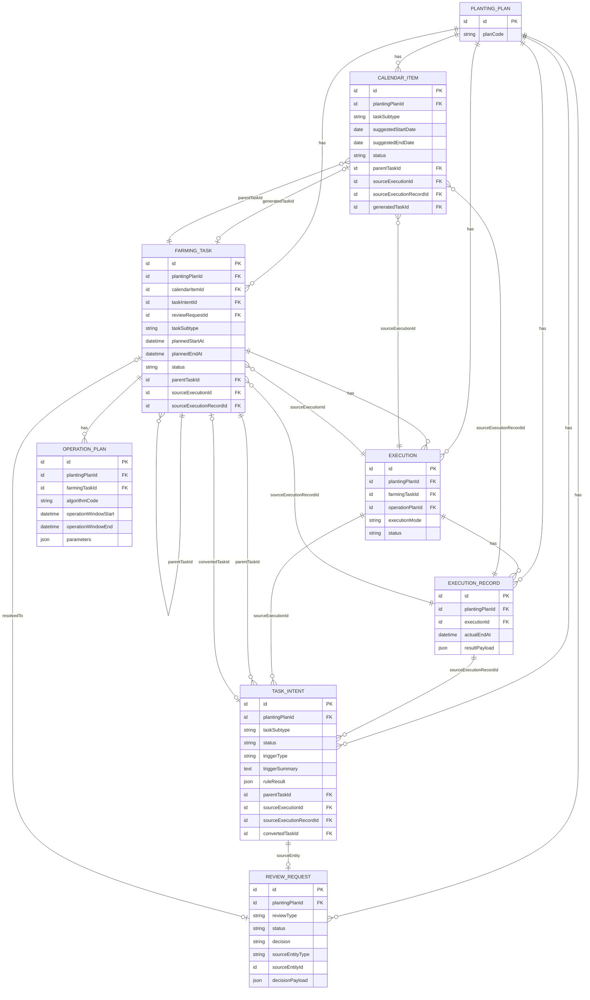

# CropFlow ER Diagram

本文档用于补充第一版核心实体关系图，重点覆盖：

- `CalendarItem / TaskIntent / FarmingTask / ReviewRequest / OperationPlan`
- 运行期调查结果触发的新农事建议链路
- `parentTaskId / sourceExecutionId / sourceExecutionRecordId`

## 1. Core ER



## 2. Traceability Rules

- `parentTaskId`
  表示这条新农事项/任务建议/正式任务在业务上延续或补救的是哪条原 `FarmingTask`。
- `sourceExecutionRecordId`
  表示直接触发本次新增对象的那条结果记录。
- `sourceExecutionId`
  表示该结果记录所属的执行过程，便于从对象追溯到执行链路。

## 3. Review Context

`ReviewRequest.decisionPayload` 当前建议至少包含：

```json
{
  "contextRefs": {
    "parentTaskId": "task_xxx",
    "sourceExecutionId": "execution_xxx",
    "sourceExecutionRecordId": "record_xxx",
    "inputTaskIds": ["task_a", "task_b"],
    "inputExecutionRecordIds": ["record_a", "record_b"]
  },
  "adjustments": {},
  "reason": ""
}
```

## 4. Weed Loop Example

以 `additional_treatment_diagnosis` 触发补防为例：

1. 原 `WF_STEM_LEAF_WEED` 完成作业。
2. 后续安全性调查、防效兼安全性调查分别生成 `ExecutionRecord`。
3. 防效兼安全性调查结果直接触发 `TaskIntent`。
4. 该 `TaskIntent.parentTaskId` 指向原茎叶除草 `FarmingTask`。
5. 该 `TaskIntent.sourceExecutionRecordId` 指向触发补防判断的防效兼安全性调查 `ExecutionRecord`。
6. `ReviewRequest` 从 `TaskIntent` 派生，`decisionPayload.contextRefs` 保留额外输入引用，例如安全性调查记录。
7. 审核通过后生成新的补防 `FarmingTask`，并继续保留 `parentTaskId / sourceExecutionRecordId`。
