# CropFlow 技术策略与团队工作说明

> 本文档用于向开发团队说明 CropFlow MVP 的技术方案、系统架构、核心对象关系和运行流转。  
> 方向分工见 `docs/planning/team-work-division.md`，推进节奏见 `docs/planning/development-roadmap.md`。

---

# 1. 项目定位

CropFlow 第一版要解决的是：围绕一个种植计划，把“什么时候该做什么农事、怎么做、做完后如何反馈和调整”串成一条可运行的业务闭环。

可以把一个 `PlantingPlan` 理解成系统的运行上下文。计划创建后，系统会根据生育期、农事日历、调查结果、算法结果和人工反馈，持续维护这个计划下的农事项、作业方案、执行记录和复核事项。

第一版重点不是把所有农事细节一次性做全，而是先跑通主链路：

```text
创建种植计划
→ 生育期预测
→ 生成农事安排
→ 形成可执行任务
→ 生成作业方案
→ 记录执行结果
→ 产生反馈或复核
→ 根据反馈继续调整计划内任务
```

---

# 2. 总体系统架构

## 2.1 架构分层

本图只表达模块分层和调用方向。

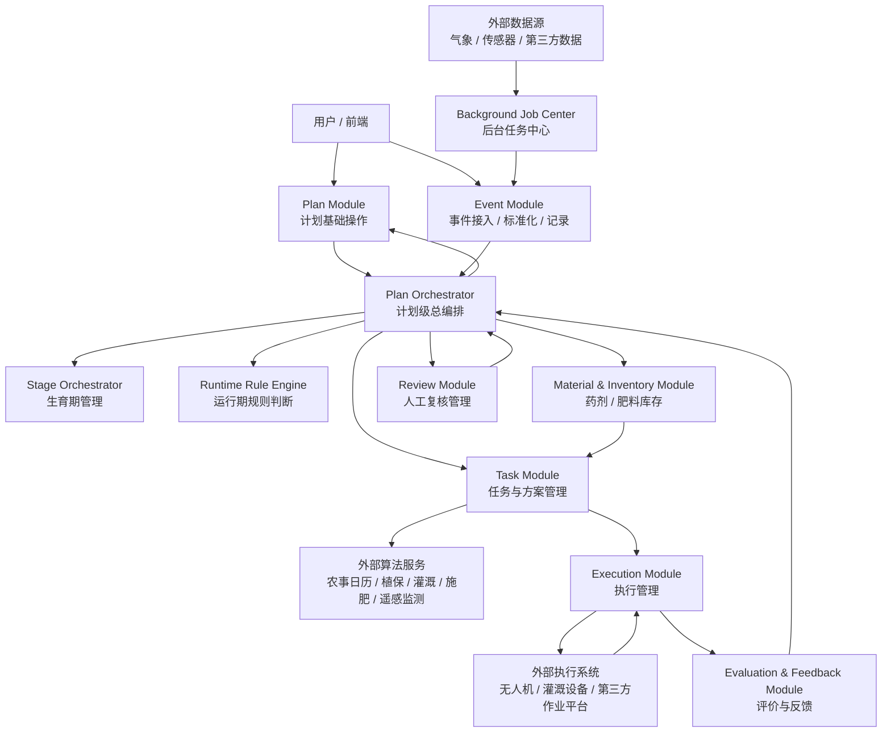

## 2.2 模块职责

| 模块 | 定位 | 核心职责 |
|---|---|---|
| Plan Module | 计划基础能力 | 创建计划、维护计划基础信息和计划状态 |
| Plan Orchestrator | 计划级流程中枢 | 接收事件，协调 Plan / Stage / Task / Execution / Feedback / Review 等模块 |
| Stage Orchestrator | 生育期能力 | 调用生育期预测，维护积温、生育期状态和预测快照 |
| Runtime Rule Engine | 运行期规则判断 | 对运行期事件做规则判断，输出任务意图、无需处理或需补充信息 |
| Task Module | 任务与方案能力 | 管理预备农事项、任务意图、正式任务和作业方案生命周期 |
| Material & Inventory Module | 物料库存能力 | 管理药剂 / 肥料库存主数据和出入库流水 |
| Execution Module | 执行能力 | 接收正式任务和作业方案，记录执行过程、执行结果和设备指令 |
| Evaluation & Feedback Module | 评价反馈能力 | 根据执行结果生成评价和反馈 |
| Review Module | 人工复核能力 | 创建复核事项，记录人工处理结论，生成系统提醒 |
| Event Module | 事件接入能力 | 接收、标准化、记录外部输入事件和后台任务事件 |
| Background Job Center | 后台任务能力 | 周期性检查气象、设备、任务到期、执行状态和调查日期推荐 |

对象名称、字段语义和关联关系见第 3 节。

## 2.3 核心边界规则

这些规则用于约束模块协作，避免不同方向开发时把流程写散：

```text
1. Plan Orchestrator 负责编排；需要变更计划状态时调用 Plan Module，不直接保存业务对象。
2. Task Module 不直接控制硬件或第三方执行系统。
3. Execution Module 只消费正式任务和作业方案，不反向创建正式任务。
4. Feedback 不能直接生成任务，必须回到 Plan Orchestrator。
5. ReviewRequestResolved 不能绕过 Plan Orchestrator。
6. Background Job Center 负责发现变化和触发事件，不替代业务模块。
7. Event Module 只做事件接入、标准化和记录，不做复杂业务决策。
```

---

# 3. 核心对象与关联关系

## 3.1 主对象链路

所有业务方向统一使用同一套对象链路：

```text
PlantingPlan
→ CalendarItem
→ TaskIntent / FarmingTask
→ OperationPlan
→ Execution / ExecutionRecord
→ Evaluation / Feedback
→ ReviewRequest
```

关键语义：

| 对象 | 含义 |
|---|---|
| `PlantingPlan` | 单个种植计划，是当前 MVP 的编排边界 |
| `CalendarItem` | 预备农事项，表示未来可能要做的农事，不是正式任务 |
| `TaskIntent` | 运行期触发后的任务意图，通常需要人工确认或补充信息 |
| `FarmingTask` | 正式农事任务，是 Execution Module 的入口 |
| `OperationPlan` | 作业方案 / 处方方案，承载算法返回的参数、处方和依据 |
| `Execution` | 一次执行实例 |
| `ExecutionRecord` | 执行过程和结果记录 |
| `Evaluation` | 执行效果评价 |
| `Feedback` | 反馈结果，必须回到 Plan Orchestrator 判断后续动作 |
| `ReviewRequest` | 人工复核事项 |
| `InventoryItem` | 药剂 / 肥料库存物料 |
| `InventoryTransaction` | 库存出入库流水 |

## 3.2 关系图

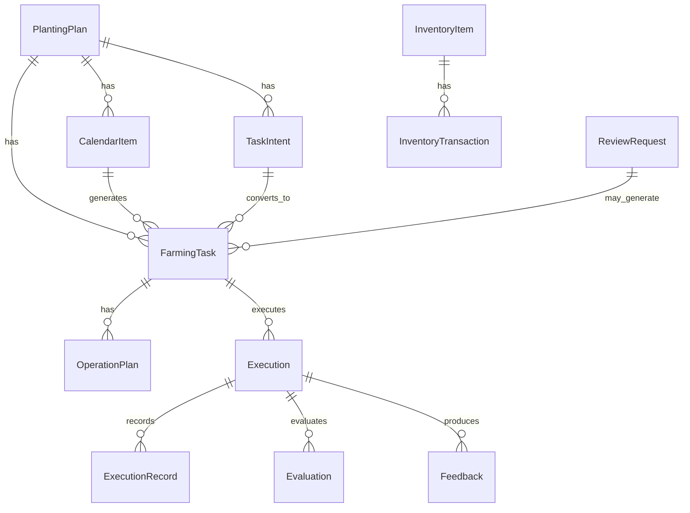

## 3.3 主对象产生方式

这张表说明每类主对象通常由哪个模块创建，以及在什么时机产生。具体字段见 `docs/model/data-model.md`。

| 对象 | 创建模块 | 典型产生时机 |
|---|---|---|
| `PlantingPlan` | Plan Module | 用户创建种植计划时产生 |
| `CropStageState` | Stage Orchestrator | 计划初始化、生育期预测刷新、人工录入真实生育期后更新 |
| `CropThermalTimeState` | Stage Orchestrator | 计划初始化后建立，气象或积温数据刷新时更新 |
| `StagePredictionSnapshot` | Stage Orchestrator | 每次调用生育期预测或修正算法后追加生成 |
| `CalendarItem` | Task Module | 农事日历接口、调查日期推荐后台任务、生育期变化重算时生成或更新 |
| `TaskIntent` | Runtime Rule Engine / Task Module | 运行期事件、调查结果、反馈结果或算法结果提示“可能需要生成任务”时产生 |
| `FarmingTask` | Task Module | `CalendarItem` 到期、`TaskIntent` 人工确认、复核结论或人工创建时产生 |
| `OperationPlan` | Task Module | `FarmingTask` 需要明确作业方案时，由算法、规则或人工录入生成 |
| `Execution` | Execution Module | 正式任务进入执行时产生 |
| `ExecutionRecord` | Execution Module | 外部执行系统回调、轮询结果、人工反馈执行结果时产生 |
| `Evaluation` | Evaluation & Feedback Module | 执行结果需要评价时产生 |
| `Feedback` | Evaluation & Feedback Module | 执行评价、人工反馈或异常结果需要回到编排器判断时产生 |
| `ReviewRequest` | Review Module | 算法结果、反馈结果或规则判断需要人工确认时产生 |
| `InventoryItem` | Material & Inventory Module | 药剂或肥料建档、首次入库时产生 |
| `InventoryTransaction` | Material & Inventory Module | 药剂或肥料入库、出库、作业消耗记录时产生 |

---

# 4. 关键流转

本节只表达跨模块主流程。单个农事项内部步骤、算法接口细节和分支条件见 `docs/workflow/task-workflow-matrix.md` 与 `docs/api/`。

## 4.1 计划创建初始化

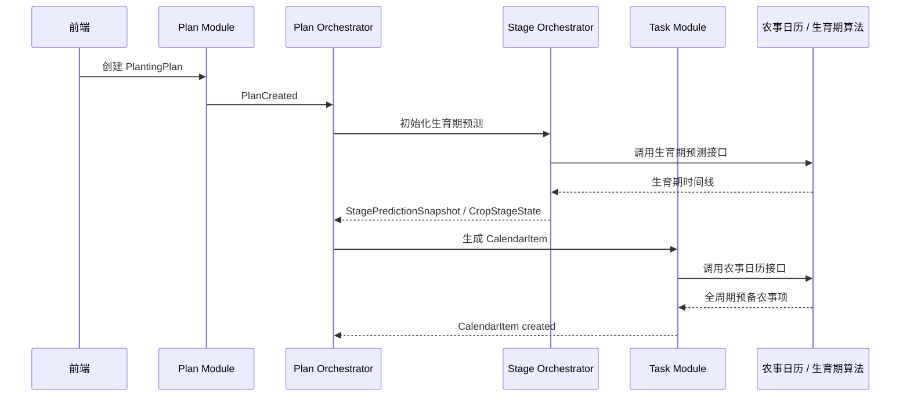

## 4.2 生育期变化与农事重算

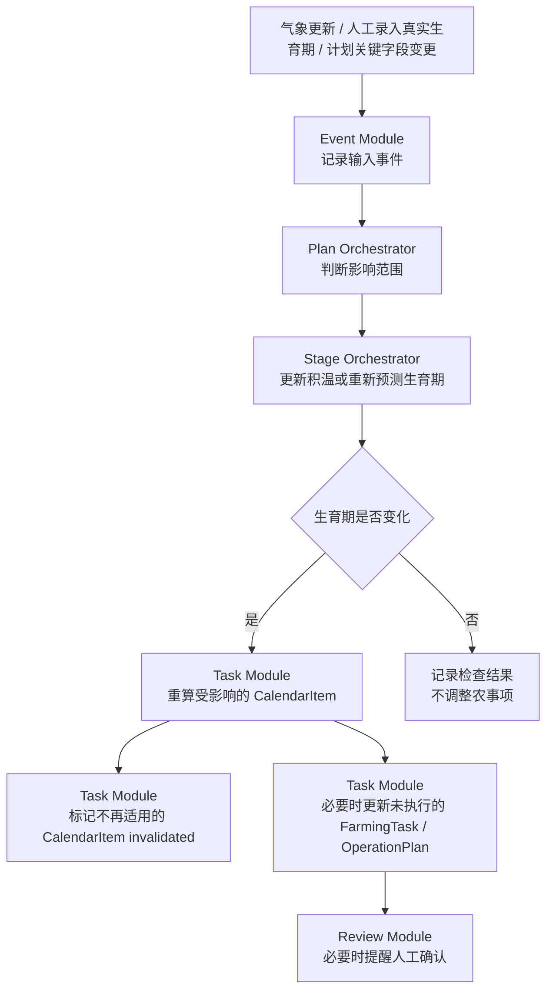

## 4.3 预备农事项生成正式任务

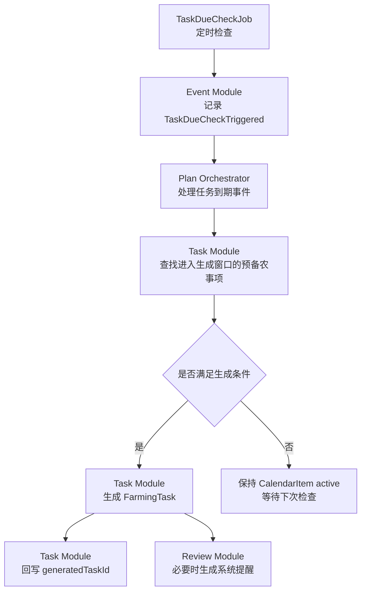

规则：

```text
1. CalendarItem 不是执行入口。
2. FarmingTask 才能进入 Execution Module。
3. CalendarItem 生成 FarmingTask 后记录 generatedTaskId。
4. 生育期变化导致 CalendarItem 不适用时，旧 CalendarItem 标记 invalidated。
```

## 4.4 运行期事件判断

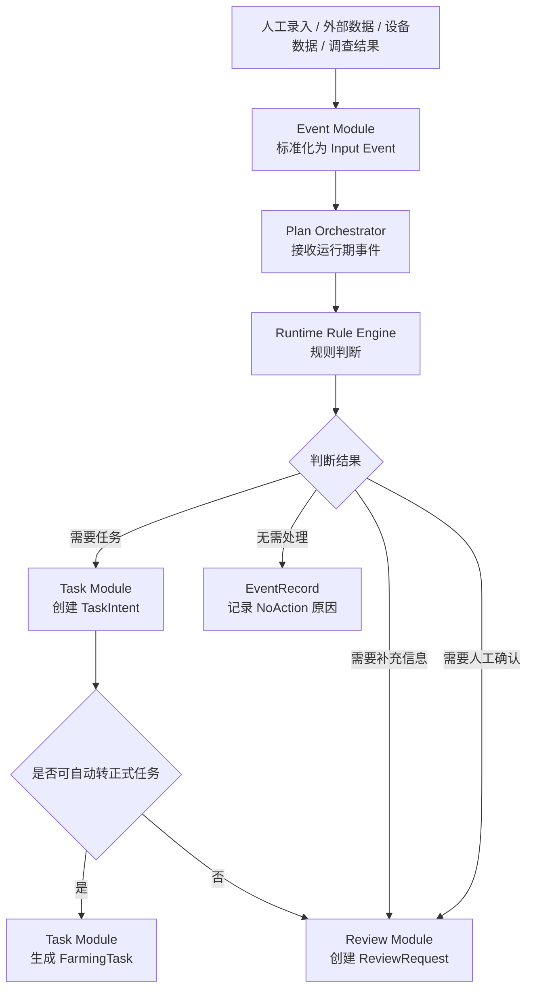

适用场景：

```text
1. 调查结果录入后需要判断是否防治。
2. 算法返回需要补防，但需要人工确认。
3. 反馈结果可能触发后续任务。
4. 复核结论可能调整任务或方案。
```

## 4.5 作业方案生成

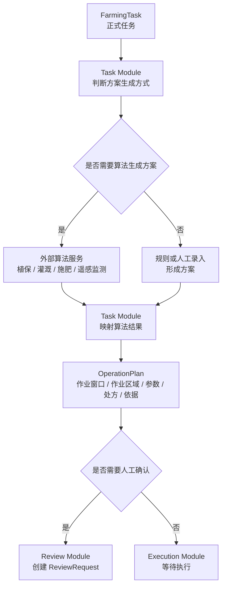

## 4.6 执行与反馈闭环

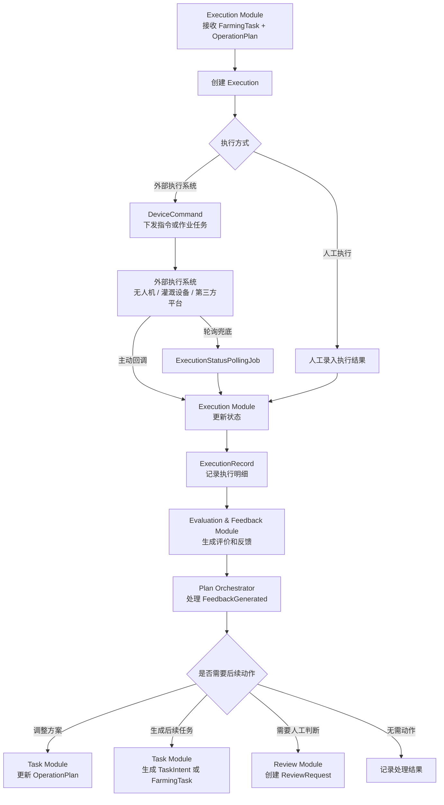

边界规则：

```text
1. Execution Module 不创建 FarmingTask。
2. Feedback 不直接创建 FarmingTask。
3. ReviewRequestResolved 必须回到 Plan Orchestrator。
4. 外部执行系统是独立外部系统，不属于普通输入源。
```

## 4.7 人工复核流转

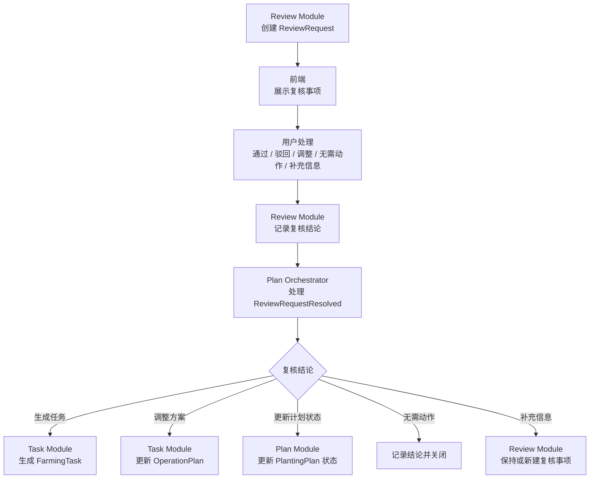

## 4.8 库存流转

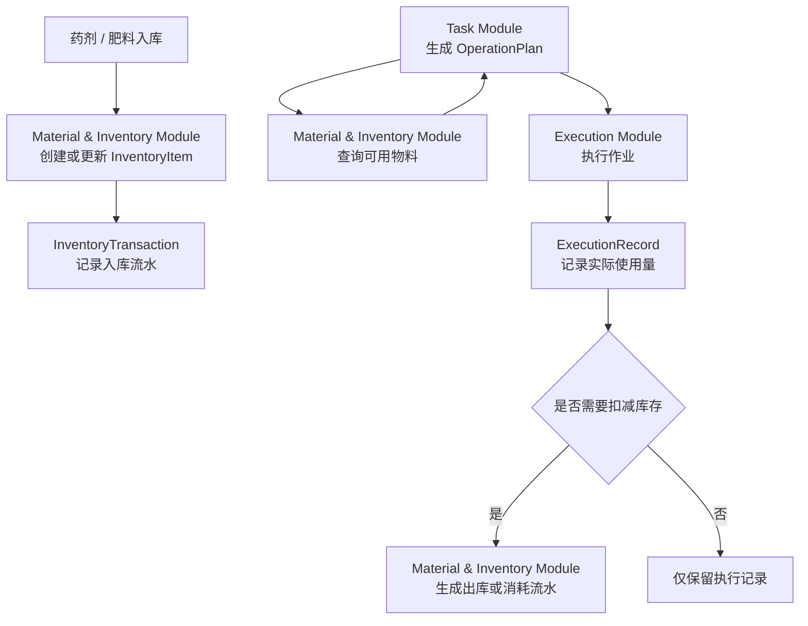

MVP 第一版只做最小库存主数据和流水，不做库位、盘点、成本核算。

## 4.9 计划状态变更

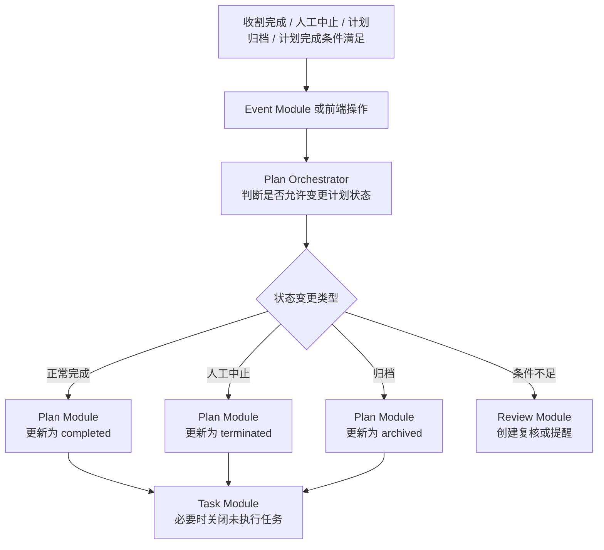

---

# 5. 技术策略

## 5.1 后端建议

团队除前端外更熟悉 Python，后端建议采用：

```text
后端：Python + FastAPI
数据库：PostgreSQL
ORM：SQLAlchemy
迁移：Alembic
数据校验 / DTO：Pydantic
接口：REST API + OpenAPI
任务调度：第一版使用简单后台任务机制，后续按需要引入调度框架
```

原因：

```text
1. FastAPI 上手成本低，适合 agent 辅助开发。
2. OpenAPI 自动生成能力方便前后端并行。
3. PostgreSQL 同时支持关系模型、唯一约束和 JSON 字段。
4. SQLAlchemy + Alembic 便于表结构和迁移演进。
```

## 5.2 前端策略

前端技术栈可以由前端负责人确定，但必须遵守：

```text
1. 以后端 OpenAPI / API contract 为准。
2. 可以先基于 mock API 开发。
```

## 5.3 不稳定字段策略

部分执行细节、设备回传、人工反馈字段当前还不稳定。第一版不为这些细节提前建复杂对象。

优先承接位置：

```text
OperationPlan.parameters
OperationPlan.prescriptionMap
OperationPlan.acceptanceCriteria
ExecutionRecord.resultPayload
ExecutionRecord.attachments
Feedback.details
ReviewRequest.decisionPayload
EventRecord.payload
```

只有满足以下条件时，才从 JSON 升级为正式字段或独立对象：

```text
1. 高频查询或筛选。
2. 需要独立状态流转。
3. 被多个模块稳定引用。
4. 需要唯一约束、幂等或统计报表。
5. 多处代码重复解析同一 JSON 结构。
```

---

# 6. 执行文档索引

团队说明材料只保留架构、对象关系和关键流转。分工和推进节奏拆到独立文档，方便不同人员按需阅读。

| 文档 | 适合阅读对象 | 内容 |
|---|---|---|
| `docs/overview/meeting.md` | 首次团队说明会参会人员 | 会议目标、议程、现场确认问题和会后行动项 |
| `docs/planning/team-work-division.md` | 产品 / 架构负责人、后端、前端、各业务方向负责人 | 各方向职责、近期任务、交付物 |
| `docs/planning/development-roadmap.md` | 全体开发人员和项目协作人员 | 当前阶段、开工前契约、第一条垂直闭环、后续扩展节奏 |
| `docs/planning/agent-development-guidelines.md` | 使用 AI agent 分工开发的人员 | Agent 任务模板、代码交付形态、禁止事项和验收清单 |

---

# 7. 每个方向提交材料模板

每个业务方向补接口或流程时，按同一模板提交：

```text
1. 业务场景：这个算法或流程解决什么问题。
2. 触发时机：由用户、后台任务、调查结果、反馈还是复核触发。
3. 输入字段：来自 PlantingPlan / Field / FarmingTask / OperationPlan / ExecutionRecord / EventRecord 的哪些字段。
4. 输出字段：返回日期、方案、处方、风险、no_action 还是需要人工确认。
5. 数据映射：输出写入 OperationPlan、TaskIntent、ReviewRequest、CalendarItem 还是 EventRecord。
6. 是否生成 FarmingTask：自动生成、人工确认后生成，还是不生成。
7. 不确定字段：先放哪个 JSON 字段。
8. 样例：至少提供一个请求样例和一个响应样例。
```

---

# 8. 第一阶段验收标准

第一阶段不以“功能很多”为目标，而以闭环可运行为目标。

验收标准：

```text
1. 可以创建 PlantingPlan。
2. 可以生成或导入 CalendarItem。
3. 可以从 CalendarItem 生成 FarmingTask。
4. 可以生成或保存 OperationPlan。
5. 可以记录 ExecutionRecord。
6. 可以生成 Feedback。
7. 可以创建并处理 ReviewRequest。
8. 所有对象能追溯 sourceEventId / sourceEntityType / sourceEntityId。
9. 前端可以查看计划、任务、方案、反馈和复核。
10. 不违反核心模块边界。
```

---

# 9. 团队协作规则

```text
1. 新增核心对象前，先更新 docs/model/data-model.md。
2. 新增农事流程前，先更新 docs/workflow/task-workflow-matrix.md。
3. 新增后台任务前，先更新 docs/workflow/background-job-matrix.md。
4. 新增算法接口前，先放 docs/api 或更新 docs/api/api-contract.md。
5. 不清楚的执行细节先放 JSON，不阻塞核心闭环。
6. PR Review 优先检查模块边界和对象语义，不只看代码能否跑通。
7. 每个方向只负责自己的算法适配和策略差异，不改变核心任务模型。
```

---

# 10. 技术说明会建议顺序

第一次团队技术说明会建议按以下顺序讲：

```text
1. 项目目标：只做 Plan-level MVP。
2. 总体架构：Plan Orchestrator 如何协调 Stage / Task / Execution / Review。
3. 核心对象关系：CalendarItem / FarmingTask / OperationPlan 的区别。
4. 关键流转：计划创建、任务生成、运行期事件、执行反馈、人工复核。
5. 技术栈建议：Python + FastAPI + PostgreSQL。
6. 分工方式：详见 docs/planning/team-work-division.md。
7. 当前已确认：植保接口、库存、后台任务、人工确认边界。
8. 下一步产出：详见 docs/planning/development-roadmap.md。
```
