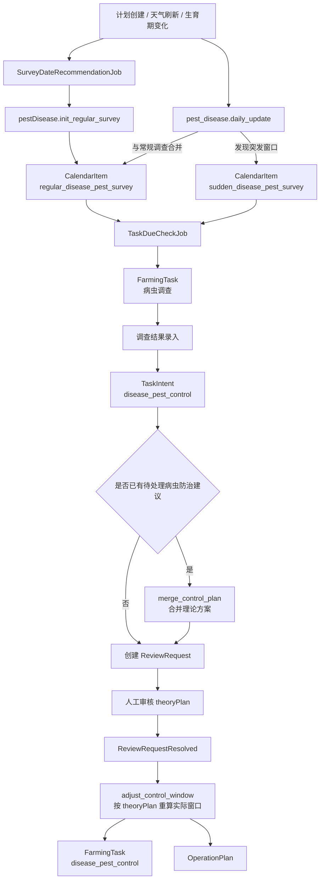

# 植保病虫害调查、防治与复核流程

---

# 1. 流程目标

说明当前已实现的病虫害植保主线，重点覆盖：

```text
1. 常规病虫害调查窗口初始化
2. 病虫害日更检查驱动的突发调查
3. 调查结果录入后的防治建议生成
4. 常规调查和突发调查建议的合并
5. 人工复核只审核 theoryPlan 的实现口径
6. 审核通过后生成正式 disease_pest_control 任务和方案
```

---

# 2. 当前实现范围

涉及的核心 `taskSubtype`：

```text
plant_protection.regular_disease_pest_survey
plant_protection.sudden_disease_pest_survey
plant_protection.disease_pest_control
```

涉及的关键算法 / 服务：

```text
pestDisease.init_regular_survey
pest_disease.daily_update
pest_disease.adjust_control_window
pest_disease.merge_control_plan
```

当前可见的防治对象：

```text
二化螟
稻纵卷叶螟
稻飞虱
稻瘟病
纹枯病
```

---

# 3. 主流程

```text
计划初始化 / 天气刷新 / 生育期变化
  ↓
SurveyDateRecommendationJob
  ↓
init-regular-survey
  ↓
生成 regular_disease_pest_survey CalendarItem

同一轮刷新中的病虫害日更检查
  ↓
pest_disease.daily_update
  ↓
生成 sudden_disease_pest_survey
或把应急调查并回 regular_disease_pest_survey

TaskDueCheckJob 到期
  ↓
正式病虫调查 FarmingTask
  ↓
调查结果录入
  ↓
生成 disease_pest_control TaskIntent
  ↓
必要时与已有建议合并
  ↓
创建 ReviewRequest
  ↓
人工审核 theoryPlan
  ↓
ReviewRequestResolved
  ↓
按 theoryPlan 重算实际窗口
  ↓
生成 disease_pest_control 正式任务 + OperationPlan
```

---

# 4. Mermaid 流程



---

# 5. 关键环节

## 5.1 常规调查初始化

```text
1. 常规调查不是在任务内部算出来，而是由 SurveyDateRecommendationJob 维护。
2. 初始化接口会返回 regular_plans，系统把它们落成 regular_disease_pest_survey CalendarItem。
3. 同一个窗口变化时，系统会复用、失效或更新已有 CalendarItem，而不是简单重复新增。
```

## 5.2 突发调查

```text
1. 每日病虫害更新会基于天气、预警和计划上下文判断是否需要突发调查。
2. 新事件可能生成 sudden_disease_pest_survey。
3. 如果新的应急调查语义已经被现有常规调查覆盖，当前实现允许把它并回 regular_disease_pest_survey。
4. 不再需要的旧 sudden 调查会被 invalidated。
```

## 5.3 调查结果到防治建议

```text
1. regular_disease_pest_survey 和 sudden_disease_pest_survey 的结果录入，都会进入同一条病虫害防治建议主线。
2. 系统先生成 taskSubtype=disease_pest_control 的 TaskIntent，而不是直接生成正式任务。
3. 对 no_action 分支，仍会持久化 TaskIntent，保留算法结论和追溯信息。
```

## 5.4 建议合并

```text
1. 如果已有未关闭的病虫害防治建议，新的调查结果不会简单重复生成一套平行正式任务。
2. 当前实现支持把新的调查结果合并进已有防治建议。
3. 合并后会生成新的 TaskIntent / ReviewRequest，并取消或替代旧建议。
4. 这个合并逻辑主要服务于“常规调查 + 突发调查”同时命中时的收口。
```

## 5.5 人工复核

```text
1. 病虫害防治当前统一走 ReviewRequest。
2. 当前审核口径不是直接改正式 controlPlan，而是只审核 proposedPlan.theoryPlan。
3. theoryPlan.rounds 支持整表编辑：增轮次、删轮次、改单轮 targets / theory_window / prescription。
4. 审核通过后，后端会基于 theoryPlan 重算 adjustedPlan、operationWindow 和正式 controlPlan。
```

## 5.6 审核通过后的正式任务

```text
1. ReviewRequestResolved 必须回到 Plan Orchestrator。
2. disease_pest_control 正式任务和 OperationPlan 都由编排器根据审核后的 theoryPlan 派生。
3. 当前病虫正式防治执行完成后，不会像杂草那样继续自动生成药后调查 CalendarItem。
```

---

# 6. 当前实现边界

```text
1. 病虫害调查日期的维护是后台 job 的职责，不在调查任务内部重新计算。
2. 调查结果录入后，防治建议必须先落 TaskIntent / ReviewRequest，不能直接跳到正式任务。
3. ReviewRequestResolved 不能绕过编排器；正式任务时间、作业窗口和 controlPlan 都以后端派生结果为准。
4. 前端在病虫害审核页应优先读取 source_task_intent.rule_result.proposedPlan.theoryPlan。
5. 前端提交 adjust 时，只应修改 proposedPlan.theoryPlan，不应直接提交 controlPlan 覆盖。
```

---

# 7. 相关文档

```text
docs/workflow/task-workflow-matrix.md
docs/workflow/background-job-matrix.md
docs/domain/plant-protection.md
docs/api/pestDisease_survey_window_api.md
docs/api/frontend-plant-protection-api-contract.md
```
