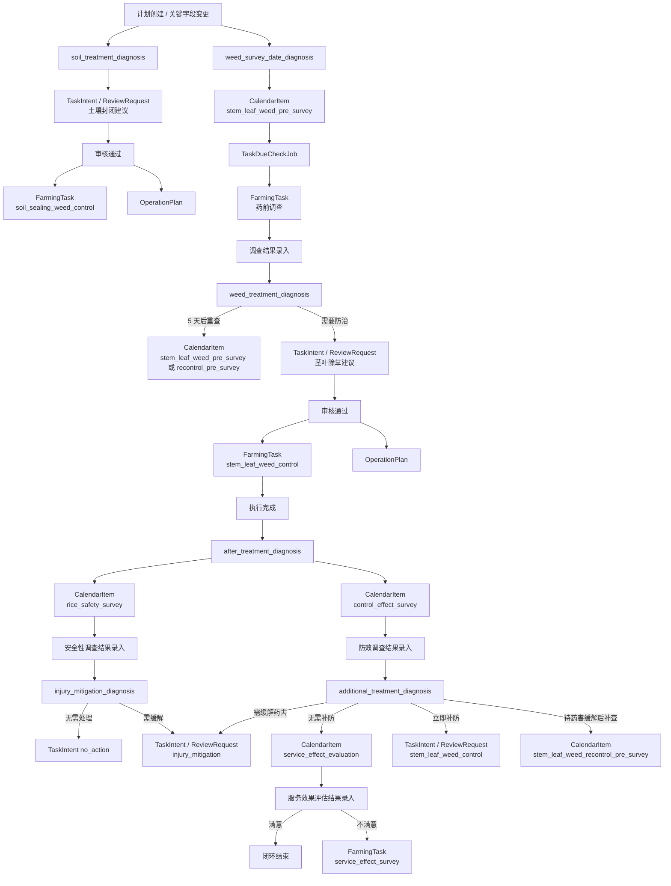

# 植保杂草主线流程

---

# 1. 流程目标

围绕当前已接入的杂草防治主线，说明从计划初始化、调查、防治、药后调查到服务效果评价的完整闭环。

当前文档覆盖：

```text
1. 土壤封闭除草
2. 茎叶除草药前调查
3. 茎叶除草正式防治
4. 药后安全性调查和防效调查
5. 药害缓解 / 补防分支
6. 服务效果评估和服务效果调查
```

---

# 2. 当前实现范围

涉及的核心 `taskSubtype`：

```text
plant_protection.soil_sealing_weed_control
plant_protection.stem_leaf_weed_pre_survey
plant_protection.stem_leaf_weed_recontrol_pre_survey
plant_protection.stem_leaf_weed_control
plant_protection.rice_safety_survey
plant_protection.control_effect_survey
plant_protection.injury_mitigation
plant_protection.service_effect_evaluation
plant_protection.service_effect_survey
```

涉及的关键算法 / 服务：

```text
soil_treatment_diagnosis
weed_survey_date_diagnosis
weed_treatment_diagnosis
after_treatment_diagnosis
injury_mitigation_diagnosis
additional_treatment_diagnosis
```

---

# 3. 主流程

```text
计划创建 / 关键字段变更
  ↓
soil_treatment_diagnosis
  ↓
土壤封闭建议先进入 TaskIntent / ReviewRequest
  ↓
审核通过后生成 soil_sealing_weed_control 正式任务和 OperationPlan

计划创建 / 天气刷新
  ↓
weed_survey_date_diagnosis
  ↓
生成 stem_leaf_weed_pre_survey CalendarItem
  ↓
TaskDueCheckJob 到期生成正式调查任务
  ↓
调查结果录入
  ↓
weed_treatment_diagnosis
  ↓
5 天后重查 或 茎叶除草建议
  ↓
防治建议先进入 TaskIntent / ReviewRequest
  ↓
审核通过后生成 stem_leaf_weed_control 正式任务和 OperationPlan
  ↓
执行完成
  ↓
after_treatment_diagnosis
  ↓
生成 rice_safety_survey + control_effect_survey 两个下游 CalendarItem
  ↓
安全性调查 / 防效调查结果录入
  ↓
injury_mitigation_diagnosis / additional_treatment_diagnosis
  ↓
no_action / 药害缓解 / 补防回流调查 / 立即补防 / 服务效果评估
  ↓
必要时进入 ReviewRequest
  ↓
审核通过后生成后续正式任务
```

---

# 4. Mermaid 流程



---

# 5. 关键分支

## 5.1 土壤封闭

```text
1. 由计划创建、播种日期或移栽日期变化触发。
2. 算法返回推荐日期和防治方案后，不直接落正式任务，先形成 TaskIntent / ReviewRequest。
3. 审核通过后才生成 soil_sealing_weed_control 正式任务和 OperationPlan。
4. 当前这条链路没有再往后自动生成调查任务。
```

## 5.2 药前调查到茎叶除草

```text
1. 药前调查日期由 SurveyDateRecommendationJob 维护，不在调查任务内部现算。
2. TaskDueCheckJob 到期后把调查类 CalendarItem 转成正式 FarmingTask。
3. 调查结果录入后调用 weed_treatment_diagnosis。
4. 如果算法返回 5 天后重查，则新增下一次药前调查 CalendarItem。
5. 如果算法返回需防治，则先生成 TaskIntent / ReviewRequest，审核通过后再落正式任务和方案。
```

## 5.3 茎叶除草执行后的下游调查

```text
1. stem_leaf_weed_control 执行完成后，会自动推荐两个下游调查日期：
   - rice_safety_survey
   - control_effect_survey
2. 这两个下游事项通过 CalendarItem 追溯到上游 execution / execution_record。
3. 当前这条链路是植保里最完整的一条“执行后继续回编排”的样板。
```

## 5.4 药害缓解和补防

```text
1. rice_safety_survey 结果进入 injury_mitigation_diagnosis。
2. control_effect_survey 结果进入 additional_treatment_diagnosis。
3. 立即补防、药害缓解等需要新增农事的分支，先进入 TaskIntent / ReviewRequest。
4. 待药害缓解后补查分支，会先生成 stem_leaf_weed_recontrol_pre_survey，而不是直接生成补防正式任务。
```

## 5.5 服务效果评估

```text
1. additional_treatment_diagnosis 返回无需补防时，会安排 service_effect_evaluation。
2. 评价满意则闭环结束。
3. 评价不满意时，当前实现会直接生成 service_effect_survey 正式任务。
4. service_effect_survey 当前录入结果后即结束，不再继续自动派生下游任务。
```

---

# 6. 当前实现边界

```text
1. 杂草链路中的正式防治建议，不允许绕过 Plan Orchestrator 直接生成正式任务。
2. CalendarItem 仍然只是预备事项；正式执行入口始终是 FarmingTask。
3. ReviewRequestResolved 仍必须回到 Plan Orchestrator，才能生成正式任务和 OperationPlan。
4. 当前杂草链路主要按人工录入调查结果和执行结果运行，不依赖设备回调。
5. 当前已实现的关键联调接口是：
   - /api/tasks/{taskId}/survey-results
   - /api/tasks/{taskId}/execution-completions
   - /api/review-requests/{reviewRequestId}
   - /api/review-requests/{reviewRequestId}/resolve
```

---

# 7. 相关文档

```text
docs/workflow/task-workflow-matrix.md
docs/workflow/background-job-matrix.md
docs/domain/plant-protection.md
docs/api/weed_diagnosis_api.md
docs/api/frontend-plant-protection-api-contract.md
```
