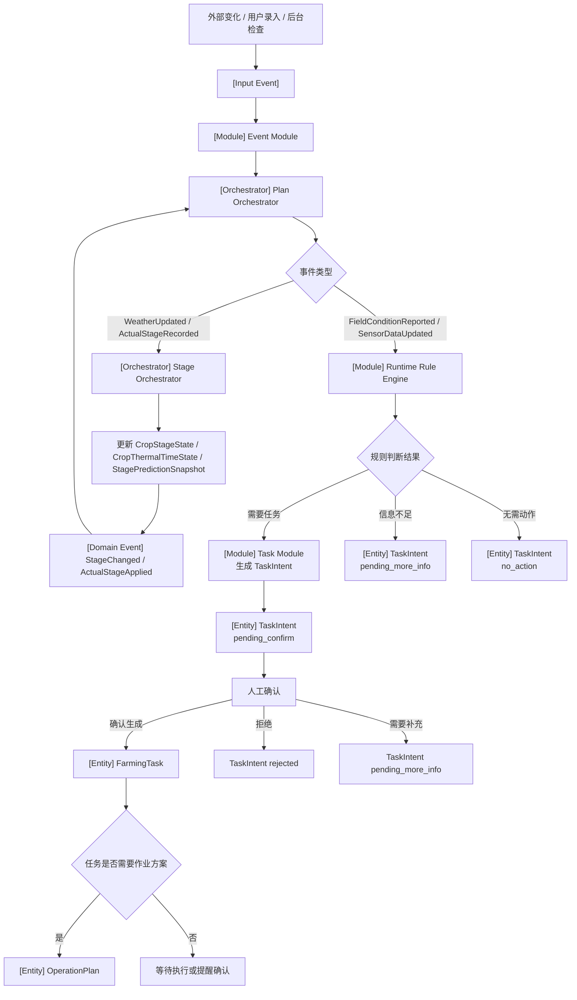

# 运行期事件触发与任务更新流程（v2：移除 Recommendation）

---

# 1. 流程目标

种植季运行过程中，系统接收气象、传感器、设备、人工录入等变化，并根据变化更新生育期、生成任务意图、更新正式任务或作业方案。

---

# 2. 主流程

```text
外部变化 / 用户录入 / 后台任务
  ↓
Input Event
  ↓
Event Module
  ↓
Plan Orchestrator
  ↓
Stage Orchestrator / Runtime Rule Engine / Task Module
  ↓
TaskIntent / FarmingTask / OperationPlan
```

---

# 3. Mermaid 流程



---

# 4. 关键事件处理

## 4.1 WeatherUpdated

```text
WeatherUpdated
  ↓
Stage Orchestrator
  ↓
更新积温和生育期预测
  ↓
如果生育期变化，产生 StageChanged
  ↓
Plan Orchestrator 协调 Task Module 更新相关任务
```

---

## 4.2 ActualStageRecorded

接口入口：

```http
POST /api/planting-plans/{plantingPlanId}/actual-stages
```

请求体按 `code: date` 传入真实生育期，例如：

```json
{
  "stages": {
    "21": "2026-05-12",
    "58": "2026-06-18"
  }
}
```

```text
用户录入真实生育期
  ↓
Event Module
  ↓
Plan Orchestrator
  ↓
Stage Orchestrator
  ↓
修正 CropStageState
  ↓
影响后续 CalendarItem / FarmingTask / OperationPlan
```

---

## 4.3 FieldConditionReported

示例：

```text
缺水
病害风险
虫害
积水
苗情异常
倒伏
```

流程：

```text
FieldConditionReported
  ↓
Runtime Rule Engine
  ↓
TaskIntent / NeedMoreInfo / NoAction
```

MVP 原则：

```text
不直接生成 FarmingTask。
先生成 TaskIntent，再由人工判断。
NeedMoreInfo / NoAction 作为规则结果或 TaskIntent 状态保存，不作为独立核心对象。
```

---

# 5. TaskIntent 结果

## 5.1 需要生成任务

```text
TaskIntent.status = pending_confirm
```

人工确认后生成：

```text
FarmingTask
```

## 5.2 需要更多信息

```text
TaskIntent.status = pending_more_info
SystemNotification 提醒用户补充信息
```

## 5.3 无需动作

```text
TaskIntent.status = no_action
```

需要持久化，便于追溯为什么没有生成任务。

---

# 6. OperationPlan 生成规则

是否立即生成 `OperationPlan` 由任务类型配置决定。

```text
1. 可立即生成：灌溉、施肥、植保等需要方案的任务
2. 执行前生成：依赖最新天气或设备状态的任务
3. 不需要生成：提醒类、巡田类任务
```

---

# 7. MVP 阶段移除 Recommendation

本流程不再生成独立 `Recommendation`。

替代方式：

| 原内容 | 当前放置 |
|---|---|
| 触发原因 | TaskIntent |
| 规则判断结果 | TaskIntent |
| 任务说明 | FarmingTask |
| 具体方案、处方、剂量 | OperationPlan |
| 方案依据 | OperationPlan |
| 用户提醒 | SystemNotification |

---

# 8. 本流程输出

```text
TaskIntent
FarmingTask
OperationPlan
SystemNotification
StageChanged
ActualStageApplied
```
